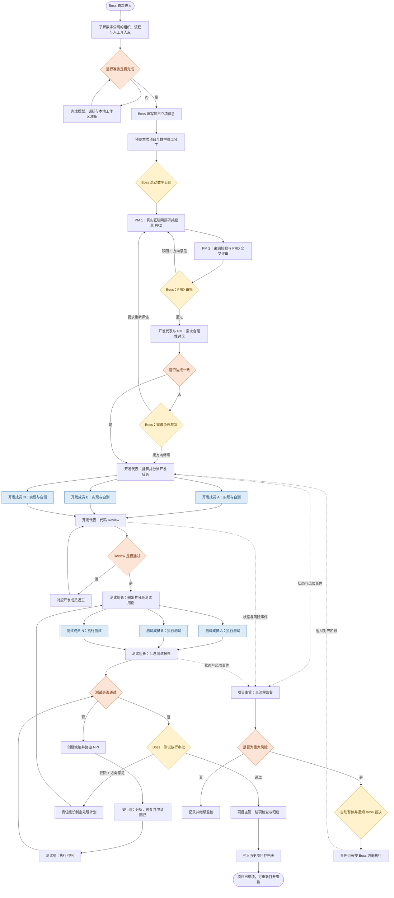
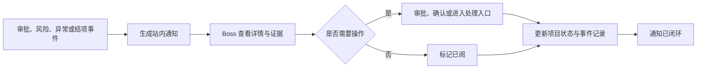

# PRD V1：本地数字研发公司

> 文档状态：需求确认稿（已纳入桌面应用交付形态）
> 目标版本：V1
> 产品负责人：产品经理
> 首要用户：在本地运行和管理数字研发公司的 Boss（用户本人）
> 文档边界：本文只定义用户、业务目标、业务流程、产品能力、成功标准与验收条件；需求矩阵、概要设计、技术选型和技术债评估在 PRD 确认后分别开展。

## 目录

- [1. 产品定位与愿景](#1-产品定位与愿景)
  - [1.1 产品定义](#11-产品定义)
  - [1.2 产品愿景](#12-产品愿景)
  - [1.3 核心价值](#13-核心价值)
- [2. 背景与待解决问题](#2-背景与待解决问题)
- [3. 用户与使用场景](#3-用户与使用场景)
  - [3.1 首要用户：Boss](#31-首要用户boss)
  - [3.2 核心使用场景](#32-核心使用场景)
- [4. V1 目标与范围](#4-v1-目标与范围)
  - [4.1 V1 目标](#41-v1-目标)
  - [4.2 V1 非目标](#42-v1-非目标)
  - [4.3 V1 产品交付形态与平台支持](#43-v1-产品交付形态与平台支持)
- [5. 组织与职责模型](#5-组织与职责模型)
  - [5.1 数字公司组织](#51-数字公司组织)
  - [5.2 细分岗位](#52-细分岗位)
  - [5.3 数字员工定义要求](#53-数字员工定义要求)
- [6. 关键业务流程](#6-关键业务流程)
  - [6.1 端到端主流程](#61-端到端主流程)
  - [6.2 项目启动](#62-项目启动)
  - [6.3 人工审批与方向意见](#63-人工审批与方向意见)
  - [6.4 自动推进、暂停与终止](#64-自动推进暂停与终止)
  - [6.5 异常、返工与风险](#65-异常返工与风险)
- [7. 核心产品功能](#7-核心产品功能)
  - [7.1 项目看板](#71-项目看板)
  - [7.2 通知中心与处理闭环](#72-通知中心与处理闭环)
  - [7.3 像素办公室](#73-像素办公室)
  - [7.4 UI 视图与真实调用控制台](#74-ui-视图与真实调用控制台)
  - [7.5 项目、任务与交付物](#75-项目任务与交付物)
  - [7.6 模型与数字员工配置](#76-模型与数字员工配置)
  - [7.7 真实调研、代码与测试](#77-真实调研代码与测试)
  - [7.8 历史项目存档](#78-历史项目存档)
  - [7.9 项目状态与事件记录](#79-项目状态与事件记录)
- [8. 产品规则与质量约束](#8-产品规则与质量约束)
  - [8.1 业务规则](#81-业务规则)
  - [8.2 易理解与可访问性](#82-易理解与可访问性)
  - [8.3 安全与隐私](#83-安全与隐私)
  - [8.4 可靠性与恢复](#84-可靠性与恢复)
- [9. 业务与产品成功标准](#9-业务与产品成功标准)
  - [9.1 标准设计原则](#91-标准设计原则)
  - [9.2 两层成功指标](#92-两层成功指标)
  - [9.3 平台成功维度](#93-平台成功维度)
  - [9.4 V1 硬性合格线](#94-v1-硬性合格线)
- [10. V1 验收标准](#10-v1-验收标准)
- [11. 业务对象词汇表](#11-业务对象词汇表)
- [12. 后续阶段边界](#12-后续阶段边界)
- [13. 调研参考](#13-调研参考)

## 1. 产品定位与愿景

### 1.1 产品定义

“本地数字研发公司”是一套由 Boss 在个人计算机上安装、启动和管理的本地 AI 数字研发桌面应用。应用把产品、研发、测试、NPI 和项目管理岗位抽象为职责明确的 AI 数字员工，使一个软件项目能够按照标准化流程完成调研、需求、开发、Review、测试、缺陷处理与结项。开发和诊断场景可以通过本机浏览器访问同一控制面，但桌面应用是 V1 的正式交付入口。

V1 以“项目管理小应用”为首个示例项目，数字员工调用真实大语言模型，访问真实公开互联网资料，在本地隔离工作区真实修改代码并运行真实测试。V1 不使用预置剧情或伪造的执行结果。

### 1.2 产品愿景

长期愿景是形成一个包含数字员工、标准流程、工具执行、质量治理和管理视图的数字研发平台，帮助大型企业在数字化转型中建立可理解、可管理、可复用和可审计的 AI 数字员工协作流程。

V1 先验证最小闭环：一个 Boss、一个活动项目、一家本地数字研发公司、一套从立项到结项的真实研发流程。

### 1.3 核心价值

1. **看得懂**：不同背景的用户都能理解项目正在做什么、由谁负责、进展如何、为何暂停以及下一步是什么。
2. **管得住**：日常工作自动推进，关键决策由 Boss 控制，角色不能越权，重要状态不能绕过。
3. **做得真**：调研来自真实互联网，内容由真实模型生成，代码与测试在真实本地工作区执行。
4. **可复盘**：任务、交付物、审批、Review、缺陷、模型调用和事件形成完整证据链。

## 2. 背景与待解决问题

单个编码 Agent 能处理局部开发任务，却难以完整覆盖产品调研、需求评审、任务拆解、代码 Review、测试、缺陷修复和项目治理。纯对话式多 Agent 协作还容易出现职责越界、信息丢失、审批缺失、状态不透明和过程难以复盘等问题。

企业采用 AI 数字员工时，不只关心“能否生成代码”，还需要回答：

- 数字员工分别承担什么职责，哪些事情不能做；
- 工作如何从一个岗位交接到另一个岗位；
- 哪些情况必须由人决策；
- 过程是否真实执行、质量是否达标；
- 失败后能否恢复，结果能否审计；
- 管理者能否快速看懂状态、风险和下一步动作。

本产品以“数字公司组织 + 标准业务流程 + 真实工具执行 + 人工关键决策”解决这些问题。

## 3. 用户与使用场景

### 3.1 首要用户：Boss

Boss 即使用本产品的用户本人，是本地数字研发公司的创建者、管理者和最终决策者。V1 不要求 Boss 是产品经理或研发工程师，也不要求其理解 Agent、模型调用或软件研发中的全部专业术语。

Boss 的职责是：

- 填写项目方向与立项信息；
- 启动数字公司承接项目；
- 查看项目状态、交付物、风险和通知；
- 在 PRD、需求争议、重大风险和测试放行等关键关卡做出“通过”或“驳回”决策；
- 给出方向级意见，不负责拆分执行细节；
- 必要时暂停、恢复或终止项目；
- 在历史项目存档中查看已结束项目。

### 3.2 核心使用场景

1. **首次启动数字公司**：Boss 安装并打开桌面应用，了解公司的组织、岗位、流程和人工介入点，完成运行准备后启动数字公司。
2. **项目立项**：Boss 输入目标用户、业务目标、优先级、截止时间和项目约束，由产品经理调研并补充产品成功指标。
3. **自动研发协作**：数字员工按职责自动推进 PRD、开发、Review、测试和 NPI 流程。
4. **关键决策**：系统在必须人工决策时暂停，通过通知引导 Boss 查看证据并审批。
5. **项目监督**：Boss 通过项目看板、像素办公室和调用控制台了解业务状态与真实执行情况。
6. **结项复盘**：项目结束后进入历史项目存档，Boss 可重新打开并只读查看完整过程。

## 4. V1 目标与范围

### 4.1 V1 目标

1. 让 Boss 能通过可安装的本地桌面应用创建并启动一间数字研发公司；开发和诊断场景允许通过本机浏览器访问同一控制面。
2. 完整运行“立项 → 调研与 PRD → 审批 → 开发 → Review → 测试 → NPI 修复 → 回归 → 放行 → 结项”的单项目闭环。
3. 用职责细分的数字员工模拟大厂产品、研发、测试、NPI 和项目管理分工。
4. 日常节点自动推进；遇到审批、重大风险或系统异常自动暂停；Boss 可主动暂停、恢复或终止。
5. 提供项目看板、通知中心、像素办公室和真实调用控制台，使业务用户与研发用户都能理解系统行为。
6. 真实调用可配置的大语言模型，真实开展公开互联网调研，真实修改本地代码并执行测试。
7. 建立从需求到任务、Review、测试、缺陷、评估和事件的完整追踪链。

### 4.2 V1 非目标

- 不接入 GitHub、Pull Request、CI/CD 或部署流程。
- 不提供公网访问、多人协作、多租户、企业账号、复杂权限、企业 SSO 或计费。
- 同一时刻只运行一个活动项目，不支持多项目并行管理。
- 不允许数字员工自行增加岗位、改变标准流程或绕过人工审批。
- 不把示例项目生成的代码表述为已经生产发布或完成线上部署。
- 不提供项目数据的本地导入、ZIP 导出或跨设备迁移。
- 不建设公网 SaaS 或企业级安全体系；V1 不提供多用户身份、企业 SSO、多租户、集中式密钥管理、WAF、DDoS 防护或高可用安全集群。
- 不在本 PRD 中规定工作流框架、Agent 框架、数据库、接口协议、部署结构或其他技术实现。

### 4.3 V1 产品交付形态与平台支持

V1 的正式交付形态是面向单机、单 Boss 的可安装桌面应用，目标平台为 macOS 和 Windows。用户完成安装后应能通过桌面图标启动应用，不要求手动启动 Python、Node、Vite、Uvicorn 或浏览器。

桌面应用必须满足以下产品约束：

- 提供 macOS 和 Windows 安装包；
- 启动后自动打开本地控制台，并统一管理前端、后端和本地辅助进程的生命周期；
- 应用安装目录与业务持久化目录分离，升级或卸载不得默认删除用户业务数据；
- 应用启动时展示模型、调研、工作区、Docker 和持久化等运行准备状态；
- Docker Desktop/Engine 是隔离代码与测试执行的本地依赖，不是前端或后端必须采用的包装方式；Docker 不可用时可以查看已有数据，但必须阻断需要隔离执行的动作；
- 默认只允许当前本机用户访问，不提供公网访问、远程控制或多人账号入口；
- 应用关闭、崩溃或重启后不得自动越过人工审批、暂停状态或其他安全门禁；
- 业务数据、凭据引用、工作区和执行证据必须遵守本 PRD 的安全、持久化和恢复规则。

本节定义产品交付形态和可观察行为，不冻结桌面框架、sidecar 打包器或安装包工具；具体技术实现由概要设计、桌面化详细设计和 DEV-11 确定。

## 5. 组织与职责模型

### 5.1 数字公司组织

| 部门/组别 | 数字员工配置 | 主要职责 | 核心交付物 |
| --- | --- | --- | --- |
| 产品区 | 2 位 PM | 用户与市场调研、竞品分析、PRD 起草、交叉评审、与开发代表澄清需求 | 调研报告、来源目录、PRD、交叉评审意见 |
| 研发区：开发组 | 1 位开发代表（组长）+ 4–5 位开发成员 | 可行性沟通、需求拆解、任务分派、代码实现、自测、代码 Review | 可行性意见、开发任务、代码变更、自测结果、Review 报告 |
| 研发区：NPI 组 | 1 位 NPI 组长 + 4–5 位 NPI 成员 | 承接测试缺陷、复现和定位问题、完成修复、协同回归 | 缺陷分析、修复任务、修复说明、回归请求 |
| 测试区 | 1 位测试组长 + 4–5 位测试成员 | 输出测试策略与用例、分派测试、执行真实测试、汇总放行建议 | 测试用例、测试结果、测试报告、缺陷单 |
| 项目主管区 | 2 位项目主管 | 监督流程规范、交付物完整性、进度、质量和风险，协调跨组问题 | 状态报告、风险报告、流程检查、结项报告 |

开发组与 NPI 组均属于研发人员，在像素办公室中位于同一个研发区，通过不同工位分区和标签区分。

### 5.2 细分岗位

V1 用少量数字员工压缩映射大型企业中的细分职责，成员不能作为无差别的同质 Agent 随机分配。

| 领域 | 岗位 | 职责边界 |
| --- | --- | --- |
| 产品 | 用户/市场 PM | 负责用户、市场、竞品和公开资料调研，不决定技术方案 |
| 产品 | 产品方案 PM | 负责范围、业务流程、功能要求、验收标准和项目成功指标，并交叉评审另一位 PM 的产物 |
| 开发 | 前端开发 | 界面与交互相关任务 |
| 开发 | 后端开发 | 业务逻辑与服务相关任务 |
| 开发 | 集成开发 | 模块协作与外部能力接入相关任务 |
| 开发 | 代码质量开发 | 自测、可维护性检查与质量建议 |
| 开发 | 开发代表 | 拆解、路由、依赖协调和最终代码 Review；成员代码未经其 Review 不得进入后续测试 |
| NPI | 缺陷分析 | 复现问题、定位原因、判断影响范围 |
| NPI | 前端/后端修复 | 按缺陷归属完成修复 |
| NPI | 回归协同 | 整理修复证据并向测试组发起回归请求 |
| 测试 | 功能测试 | 验证主流程和业务验收标准 |
| 测试 | 边界/异常测试 | 验证异常、边界和错误处理 |
| 测试 | 接口/集成测试 | 验证模块契约和跨模块协作 |
| 测试 | 回归测试 | 验证修复结果及其影响范围 |
| 项目主管 | 流程主管 | 检查状态、审批与交付物是否完整 |
| 项目主管 | 质量/风险主管 | 识别进度与质量风险，判断是否需要升级 Boss |

### 5.3 数字员工定义要求

每个岗位必须具有明确的角色目标、职责、输入、输出、可使用工具、可见信息、允许处理的业务对象和禁止事项。员工只能在职责范围内工作，跨岗位事项必须通过结构化消息交接给对应负责人。

## 6. 关键业务流程

### 6.1 端到端主流程

### 6.2 项目启动

首次使用时，系统必须用非技术化语言向 Boss 介绍：数字公司的部门与岗位、项目会经历的阶段、哪些工作自动执行、哪些情况需要人工介入、可能产生的模型调用与本地代码变更。

启动分为四步：

1. **引入数字公司**：展示公司组织图、员工职责、标准流程和 Boss 的决策边界。
2. **运行准备检查**：展示模型服务、公开资料调研能力和本地项目工作区是否可用；缺少必要条件时说明影响和处理入口。
3. **填写项目立项信息**：Boss 必须填写项目名称、业务目标、目标用户、固定优先级、截止时间和已知约束。项目成功指标由 PM 调研后提出，不要求 Boss 填写。
4. **确认启动**：展示立项摘要、预计参与部门和首个执行阶段，Boss 确认“启动数字公司”后才开始产生真实模型调用和工作区操作。

优先级固定为：

| 级别 | 产品含义 |
| --- | --- |
| P0 | 阻断性、最高紧急度；发生风险时优先通知并暂停相关流程 |
| P1 | 本期必须完成的核心目标 |
| P2 | 重要但可根据风险和期限调整 |
| P3 | 低优先级优化，不得影响更高优先级事项 |

### 6.3 人工审批与方向意见

| 审批关卡 | Boss 看到的关键信息 | 决策 | 后续处理 |
| --- | --- | --- | --- |
| PRD 审批 | 用户问题、产品目标、范围、非范围、成功指标、调研证据、PM 交叉评审 | 通过 / 驳回 + 方向意见 | 通过后进入研发讨论；驳回后 PM 修改 |
| 需求争议 | 争议点、PM 判断、开发影响、证据与可选方向 | 通过 / 驳回 + 方向意见 | 由对应组长拆成执行细节 |
| 重大风险 | 风险等级、影响范围、触发证据、待决策问题和建议方向 | 通过 / 驳回 + 方向意见 | 责任组长形成整改任务 |
| 测试放行 | 测试范围、通过情况、未关闭缺陷、回归结果和放行建议 | 通过 / 驳回 + 方向意见 | 通过后结项；驳回后回到责任环节 |

Boss 只决定大的方向，不负责填写技术方案、拆解员工任务或编写详细执行步骤。系统必须把 Boss 意见发送给相应组长，由组长转化为任务，并在后续交付物中标明如何响应该意见。

### 6.4 自动推进、暂停与终止

- 项目在前置条件满足时自动推进，并允许互不冲突的成员任务并行执行。
- 到达人工审批、出现重大风险或系统异常时自动暂停，不得继续启动受影响的后续任务。
- 暂停信息必须说明原因、影响范围、等待谁处理、可采取动作和恢复条件。
- Boss 可主动暂停；暂停后不启动新任务，已完成内容全部保留。
- Boss 可恢复项目；项目从最近有效状态继续，不重复已完成任务，除非该任务被明确要求重试。
- Boss 可终止项目，但必须填写非空终止原因并完成二次确认。确认页必须展示当前阶段、未完成任务、影响和“终止后不能继续运行”的提示。
- 终止项目进入历史存档，可只读查看，不可恢复为活动项目。

### 6.5 异常、返工与风险

- 交付物不完整或不符合要求时，责任员工先自动重试一次；再次失败则形成阻塞并通知项目主管。
- 代码 Review 驳回只退回对应开发任务，不重置其他已经通过的任务。
- 测试失败必须形成缺陷，由 NPI 处理并重新进入测试回归，不能直接结项。
- 同一任务重复失败、同一缺陷重复回归失败、交付物缺失或明显延期时，项目主管必须形成风险报告。
- 一般风险由责任组长处理；重大风险暂停相关流程并通知 Boss。
- 所有驳回、返工、失败和恢复都必须保留原始对象、处理意见和新版本之间的关联。

## 7. 核心产品功能

### 7.1 项目看板

Boss 进入活动项目后首先看到项目看板。看板必须实时反映持久化的项目状态，而不是只显示装饰性动画。

看板至少包含：

- 项目名称、业务目标、目标用户、优先级、截止时间和当前阶段；
- 整体进度及各阶段状态：未开始、进行中、等待人工、阻塞、已完成、已终止；
- 当前正在工作的员工、任务、已完成比例、开始时间和等待对象；
- 待 Boss 处理的审批、重大风险和系统异常；
- 任务总数、完成数、返工数、缺陷数和未关闭缺陷数；
- 最新交付物、最新事件和下一步预计动作；
- 本次运行的模型调用次数、耗时、错误、Token 与成本摘要；
- 暂停、恢复和终止控制。

Boss 可从任一看板卡片进入对应任务、员工、交付物、审批、风险或事件详情。

### 7.2 通知中心与处理闭环

系统必须为以下事件产生站内通知：待审批、重大风险、系统异常、任务阻塞、重要期限风险、项目结项和项目终止。P0 事项和导致流程暂停的事项显示为最高提醒等级。

每条通知必须包含通知类型、等级、项目/任务、发生时间、原因摘要、需要 Boss 做什么以及详情入口。通知处理闭环为：

未处理且影响流程的通知必须持续显示，不得因已打开而自动消失。通知的已读状态、处理人、处理时间、处理动作和关联状态变化必须可追溯。浏览器系统通知作为可选提醒，默认以站内通知为准。

### 7.3 像素办公室

像素办公室的核心目标是帮助用户理解系统正在做什么，而不是仅做视觉展示。

- 办公室分为产品区、研发区、测试区和项目主管区；研发区内以工位区分开发组与 NPI 组。
- 每名员工以原创像素人物呈现，并同时用文字显示姓名/岗位、当前任务、进度、状态和等待对象。
- 状态必须同时通过颜色、图标和文字表达，不能只依赖颜色。
- 点击员工可查看结构化消息、交付物、工具调用、Review/审核报告与意见、事件日志。
- 点击工位或部门可查看该组的任务队列、负责人、阻塞和最新交接。
- Boss 需要人工介入时，相关员工、工位、任务和通知入口必须建立清晰关联。
- 页面必须提供术语解释、空状态、加载状态、错误状态和下一步提示，避免要求用户具备产品或研发背景。

### 7.4 UI 视图与真实调用控制台

主界面提供“UI 视图 / 调用控制台”切换按钮：

- **UI 视图**面向业务和普通用户，用自然语言展示阶段、员工、任务、交付物、风险、审批和下一步动作。
- **调用控制台**面向希望核验真实执行或调试的研发用户，按时间展示实际模型调用、工具调用、命令与测试日志。

调用控制台至少展示：调用所属项目/任务/角色、模型提供商与模型名称、开始和结束时间、耗时、输入摘要、结构化输出摘要、工具名称与参数摘要、命令与测试结果、Token 与成本、标准化错误、重试次数和可关联的链路标识。

两个视图必须指向同一业务事件和同一实际状态，用户可从 UI 中的任务跳转到对应调用，也可从调用记录回到业务任务。界面不得展示 API Key、隐藏提示词、内部思维过程或未经脱敏的敏感信息。

### 7.5 项目、任务与交付物

- 同一时刻只允许一个活动项目；开始新项目之前，当前项目必须已结项或已终止。
- 任务至少显示标题、负责人、专业标签、分派理由、优先级、前置依赖、预期交付物、状态和时间。
- 任务状态统一为：待处理、进行中、等待 Review、等待审批、阻塞、返工、已完成、已终止。
- 数字员工之间只传递结构化业务消息；消息必须关联发送方、接收方、项目、任务、时间和处理状态。
- 系统维护调研报告、来源目录、PRD、可行性意见、任务拆解、代码变更、自测结果、Review 报告、测试用例、测试报告、缺陷、修复说明、评估记分卡和结项报告。
- 每份交付物必须包含名称、类型、版本、负责人、创建时间、所属任务、状态及上下游关联。
- Boss 可查看交付物摘要和完整内容，并在需求、开发任务、测试用例与缺陷之间双向追踪。

### 7.6 模型与数字员工配置

- V1 支持配置 OpenAI 和 DeepSeek 提供的可用模型。
- Boss 可分别为产品、开发、NPI、测试和项目主管五个领域选择模型提供商与模型；同一领域员工默认继承其领域配置。
- 项目运行中允许切换领域模型；正在执行的任务沿用启动时的配置，后续任务使用新配置。
- 每次变更必须记录变更前后内容、时间和受影响领域；每个任务和交付物可追溯到实际使用的模型配置。
- 设置页提供连接检测、凭据更新和凭据删除；凭据不可用时，相关任务进入可解释的阻塞状态，不得静默切换模型。
- 凭据明文不得出现在前端、数字员工上下文、交付物、消息、日志或历史项目中。

### 7.7 真实调研、代码与测试

#### 产品调研

- PM 必须真实访问互联网，检索竞品和公开资料，并在调研报告中保留页面标题、链接、发布者、可获得的发布日期、访问时间、来源类型和所支持的结论。
- “官方一手来源”指被调研产品或公司自己发布的原始资料，例如产品官网、官方帮助中心、官方文档、官方定价页和官方发布说明。它可以直接证明“该公司公开声明其产品具有某项功能”，但不能单独证明该功能效果好、市场受欢迎或优于竞品。
- 产品官网直接声明的客观功能，允许使用一个直接对应的官方一手来源。
- 影响产品方向的市场、用户、趋势、效果或竞品优劣结论，必须至少有两个相互独立的来源。独立来源需来自不同组织或编辑主体，转载同一稿件不算两个来源。
- 第二位 PM 必须核验关键来源是否可访问、证据是否支持结论、来源是否独立；证据冲突时保留双方证据和判断理由。
- 未获得充分证据的内容只能标记为“待验证假设”，不得作为确定事实进入方向决策。
- 网页中的指令不得改变 PM 的角色、流程或工具权限；疑似恶意内容形成安全事件。

#### 代码与测试

- 开发、测试和 NPI 在本地项目工作区内真实读取和修改文件，真实执行被允许的构建、检查和测试操作。
- 并行开发任务使用相互隔离的可写工作区，不能互相覆盖。
- 开发成员提交代码变更和自测证据后，必须由开发代表 Review；未通过的变更不能进入测试基线。
- 测试必须基于已 Review 的项目版本执行；测试失败形成缺陷并进入 NPI。
- NPI 修复必须再次经过回归测试，不能以文字声明代替真实测试结果。
- 每次文件变更、Review、命令执行、退出结果、测试结果和失败原因必须关联到任务和事件。
- 数字员工不得访问项目授权范围之外的本地文件，也不得执行未经项目允许的操作。

#### 编码 Agent 产品行为

编码 Agent 是研发团队的核心执行能力。它不是只根据一句话生成代码，而是围绕一个开发任务完成“理解上下文、制定计划、实施修改、执行验证、根据反馈修复、提交 Review”的闭环。编码 Agent 的每次执行必须能够被暂停、恢复、审阅和追踪。

编码 Agent 必须遵循以下工作阶段：

1. **任务理解**：读取已批准需求、验收标准、任务依赖、项目约束、相关文件和现有测试，不得在缺少关键上下文时直接大范围修改。
2. **变更计划**：输出目标、影响文件、拟采用方案、验证命令、风险和不确定项；计划未经任务策略允许时不得进入写入阶段。
3. **增量实施**：按小批次修改文件，每批修改后保留 diff 和原因，禁止无依据地重写整个项目。
4. **执行反馈**：运行允许的格式检查、类型检查、构建和测试，把命令、版本、退出码、标准输出/错误和证据关联到本次执行。
5. **失败修复**：根据真实失败结果定位原因并形成下一次尝试；不得把同一失败无限重试，也不得用文字声明替代测试。
6. **自检与交接**：完成变更摘要、测试摘要、剩余风险、未解决问题和 Review 请求，提交给开发代表；编码 Agent 不能自行批准自己的 Review 或关闭缺陷。

编码 Agent 必须维护可恢复的执行上下文。上下文至少包含任务目标、已批准约束、已读取文件、已修改文件、当前 diff、已执行命令、失败摘要、测试结果和下一步动作。上下文过长时可以压缩历史，但不得丢失当前变更、失败原因和未完成事项。

编码 Agent 的工具使用必须按任务授权：文件读取、搜索、编辑、命令、测试和证据写入分别受工具策略和工作区范围限制。高风险命令、越界路径和不确定的破坏性操作必须被阻止或转为人工处理。

编码 Agent 的完成条件不是“模型返回完成”，而是同时满足：代码变更存在、变更符合任务目标、自测或验证证据齐全、工作区无未说明的额外变更、剩余风险已列明，并已提交开发代表 Review。

### 7.8 历史项目存档

已结项和已终止项目自动进入“历史项目存档表”，替代本地导入/导出功能。

存档表至少显示：项目名称、最终状态、优先级、创建时间、结束时间、运行时长、最终评估结果、缺陷概况、模型成本摘要和操作入口。支持按名称搜索，按状态、优先级和日期筛选。

- **重新打开查看**：Boss 可重新打开历史项目，以只读方式查看看板、像素办公室最终状态、PRD、任务、Review、测试、缺陷、评估和事件；重新打开不代表恢复运行。
- **删除项目**：Boss 可删除历史项目。第一次点击删除后，系统必须展示项目名称、状态、结束时间和将被删除的数据范围；Boss 完成第二次明确确认后才执行删除。
- 删除属于不可恢复操作，确认界面必须清楚说明。删除后保留最小化删除审计信息（项目标识、删除时间和操作者），不保留已删除项目的业务内容。
- 活动中或暂停中的项目不能从历史表删除；如需移除，必须先按终止流程处理。

### 7.9 项目状态与事件记录

项目主状态统一为：准备中、运行中、等待 Boss、已暂停、已阻塞、结项中、已结项、已终止。

每次状态变化和关键动作都形成事件，至少关联项目、任务、责任角色、事件类型、输入摘要、输出交付物、发生时间、耗时、结果、失败原因和重试情况。事件按时间顺序追加，历史内容不能被后续结果覆盖。

应用重新启动后，活动项目、历史项目、交付物、事件和最近有效状态必须仍可查看；活动项目可按恢复规则继续。

## 8. 产品规则与质量约束

### 8.1 业务规则

1. 未填写完整立项信息，不能启动数字公司。
2. PM 未提交成功指标和必要调研证据，PRD 不能进入 Boss 审批。
3. 未经 Boss 批准的 PRD 不能进入开发拆解。
4. 未经开发代表 Review 的代码变更不能进入测试。
5. 存在未关闭的阻断性缺陷，不能进入测试放行。
6. 必须人工审批的关卡不能被数字员工或自动流程绕过。
7. 重大风险和系统异常未解除前，相关流程不能继续。
8. Boss 的方向意见必须由责任组长拆解，不能直接被当作成员执行指令。
9. 历史项目重新打开后只能查看；删除必须二次确认。

### 8.2 易理解与可访问性

- 专业术语首次出现时提供解释，并可跳转到本文词汇表。
- 重要状态使用文字、图标和颜色共同表达。
- 业务视图默认隐藏低层技术细节，但提供查看证据和切换调用控制台的入口。
- 审批与风险页面按“发生了什么—为何需要你—依据是什么—可做什么—之后会怎样”组织信息。
- 错误提示必须说明影响、是否已暂停、数据是否保留和用户可采取的下一步。
- 关键页面应适配常见桌面浏览器窗口，不要求用户理解产品、研发或模型专业知识。
- 桌面应用主窗口应适配 1280×720 及以上的常见桌面视口；主要操作不得被窗口边界、系统缩放或启动状态遮挡。
- 首次启动、依赖缺失、sidecar 异常、升级迁移和安全阻断必须使用非技术化语言说明影响、数据是否保留和下一步动作。

### 8.3 安全与隐私

- V1 默认只允许 Boss 在运行该产品的本地计算机上使用。
- 本地控制面默认只接受本机访问；高风险操作（启动、暂停、恢复、终止、历史删除和关键审批）必须经过业务规则校验、必要的二次确认并留下事件记录。
- 除模型调用和 PM 公开资料调研所需信息外，不主动向外部服务发送项目数据。
- 模型凭据只能由本机安全凭据存储保管；凭据明文不得显示在 UI、数字员工上下文、交付物、控制台、通知、日志、事件、备份或错误信息中。
- 外部网页内容被视为不可信资料，不得改变数字员工的职责和系统规则。
- 本地工作区操作必须受项目授权范围限制，避免数字员工接触无关文件；命令执行必须受允许清单、路径、资源、超时和容器隔离约束。
- 关键执行、审批、凭据配置变更、越界拒绝、敏感信息脱敏和安全失败必须形成可追踪事件；展示给 Boss 的摘要不得包含密钥、令牌或隐藏提示词。

### 8.4 可靠性与恢复

- 自动推进过程可暂停、可恢复，并保留最近有效状态。
- 重启应用不能丢失已经完成的任务、审批、交付物或事件。
- 外部模型或调研服务不可用时，应阻塞对应任务并说明原因，不影响已保存数据。
- 同一动作重复触发不得无提示地产生重复审批、重复任务或覆盖已有交付物。
- 桌面应用升级不得破坏已提交的项目、任务、审批、交付物、事件和最近有效状态；不兼容 Schema 必须进入可查询的只读/阻断状态。

## 9. 业务与产品成功标准

### 9.1 标准设计原则

V1 不用单一的“生成了多少代码”判断成功，而从业务结果、流程效率、质量稳定性、可靠性、协作治理、用户理解和成本七个维度评估。这一设计参考了大型研发组织常用的多维方法：DORA 强调交付吞吐与稳定性应结合衡量；Google SRE 强调以用户体验为中心设定可靠性目标；SPACE 强调研发效能不能由单一指标代表；腾讯云的模型观测与链路能力体现了调用量、延迟、错误、Token、输入输出及链路追踪等 AI 应用运行指标。

### 9.2 两层成功指标

- **项目成功指标**：描述示例项目本身是否解决目标用户问题，由 PM 在调研后为每个项目提出，包含指标名称、目标值、统计口径和验证方式，经另一位 PM 评审并随 PRD 交 Boss 审批。
- **平台成功指标**：描述“本地数字研发公司”是否可靠完成标准研发流程，由本节定义并用于 V1 验收与运行记分卡。

### 9.3 平台成功维度

| 维度 | 核心问题 | V1 指标与要求 |
| --- | --- | --- |
| 业务闭环 | 数字公司能否真正完成一个项目 | 代表性项目能从立项运行至结项；关键交付物齐全；每项项目成功指标都有验证结果或明确的待验证说明 |
| 流程效率 | 工作是否顺畅，等待和返工是否可解释 | 记录总周期、各阶段耗时、等待人工时长、阻塞时长和返工次数；可按阶段与角色定位主要等待点 |
| 质量与稳定性 | 需求、代码和测试是否形成质量闭环 | 已批准的验收标准必须关联开发任务和测试用例；真实测试证据覆盖率 100%；结项时阻断性缺陷为 0；全部已接受缺陷均有处理结论 |
| 可靠性与恢复 | 失败后是否保留状态并继续 | 审批、风险或异常暂停时数据不丢失；应用重启后可恢复最近有效状态；模型调用失败率、任务失败率和恢复时长可统计 |
| 协作与治理 | 职责、审批和交接是否清晰 | 审批绕过数为 0；非法状态流转数为 0；关键业务事件记录完整率 100%；每个任务、交付物和意见可追溯责任角色 |
| Boss 可理解性 | 非专业用户能否看懂并完成决策 | Boss 可在看板识别当前阶段、阻塞原因、待处理事项和下一步；审批页提供决策所需摘要、证据和影响；首次使用提供术语说明 |
| AI 运行与成本 | 模型使用是否透明、可比较 | 按领域与模型展示调用次数、平均耗时、错误率、Token、成本、重试和完成任务成本；V1 建立基线，不以单一成本指标替代质量判断 |

### 9.4 V1 硬性合格线

以下任一项不满足，则本次评估运行不能判定为合格：

1. 必须人工审批的关卡绕过数不为 0。
2. 非法状态流转数不为 0。
3. 关键任务、审批、工具调用或交付物存在无法追踪的断链。
4. 已批准验收标准未完整关联开发任务与测试用例。
5. 测试结果缺少真实执行证据。
6. 结项时仍存在未关闭的阻断性缺陷。
7. PM 的关键方向结论未满足来源规则。
8. 暂停、异常或重启后已完成业务数据丢失。
9. Boss 无法确认当前状态、暂停原因或下一步动作。

样本场景数量、统计周期以及非硬性指标的目标阈值将在 PRD 确认后的需求矩阵与评估方案中冻结，避免在缺少运行基线时随意设定数字。

## 10. V1 验收标准

AC-01. Boss 首次进入时能看到数字公司的组织、流程、人工介入点和运行准备状态。
AC-02. Boss 填写项目名称、业务目标、目标用户、P0–P3 优先级、截止时间和约束后，能确认并启动数字公司；缺少必填项时不能启动。
AC-03. 两位 PM 能真实调研并产生来源目录、PRD 和交叉评审；来源不满足要求时不能提交 Boss 审批。
AC-04. PRD 包含 PM 定义的项目成功指标，Boss 只负责审批而不被要求填写指标或技术方案。
AC-05. 所有 Boss 审批都支持通过或驳回并填写方向级意见，意见能被责任组长转成任务并形成响应记录。
AC-06. 开发代表能将批准需求拆成至少 3 个专业任务并分派；开发成员真实修改代码和自测，代码必须经过开发代表 Review。
AC-07. 测试组长能输出并分派用例；测试成员执行真实测试，失败后自动形成缺陷并路由 NPI。
AC-08. NPI 完成真实修复后必须进入测试回归，未通过不能结项。
AC-09. 项目在无人工关卡和异常时自动推进，在审批、重大风险或系统异常时自动暂停。
AC-10. Boss 可主动暂停和恢复项目；恢复不丢失历史，也不无故重复已完成任务。
AC-11. Boss 终止项目时必须填写原因并二次确认，终止后项目不可继续运行但可在历史存档查看。
AC-12. 项目看板能实时展示阶段、进度、员工任务、审批、风险、缺陷、最新交付物、事件和下一步动作。
AC-13. 通知中心能覆盖审批、重大风险、系统异常、阻塞、期限风险和结束事件，并记录从通知到处理结果的闭环。
AC-14. 像素办公室能显示每位员工的岗位、任务、进度、状态、等待对象和人工介入信息，而非仅播放角色动画。
AC-15. 用户能在 UI 视图与真实调用控制台之间切换，并从同一业务任务双向关联模型调用、工具、命令和测试记录。
AC-16. 调用控制台可查看模型、耗时、摘要、工具、测试、Token、成本、错误和链路标识，但不泄露凭据、隐藏提示词或内部思维过程。
AC-17. Boss 能分别配置产品、开发、NPI、测试和项目主管领域所用的 OpenAI 或 DeepSeek 模型，配置变更只影响后续任务且可追溯。
AC-18. 开发、NPI 和测试在相互隔离的本地工作区真实修改文件或运行测试，未 Review 的变更不能进入测试。
AC-19. 系统重启后，活动项目、最近有效状态、交付物、审批和事件仍然存在，并可按规则恢复。
AC-20. 已结项和已终止项目出现在历史项目存档表，可重新打开只读查看全部业务资料。
AC-21. 历史项目只有在二次确认后才能删除；删除提示清楚说明范围与不可恢复性。
AC-22. 产品不提供项目 ZIP 导出、本地导入、GitHub、Pull Request、CI/CD 或部署入口。
AC-23. 每次运行能生成七个维度的评估记分卡，并正确判定第 9.4 节的硬性合格条件。
AC-24. 不具备产品或研发背景的用户可通过页面说明和词汇解释识别当前状态、待决策事项及下一步动作。
AC-25. V1 安全基线能够阻止凭据泄露、网页提示注入、工作区越界和未授权命令，并能对关键安全事件进行脱敏记录和追踪；产品不出现企业级身份与安全平台入口。
AC-26. 编码 Agent 能围绕一个真实开发任务完成上下文理解、计划、增量修改、真实验证、失败修复、变更总结和 Review 交接；每个阶段均有可查看的状态、证据和失败原因，不能只返回一段代码文本。
AC-27. V1 必须提供可安装的 macOS 和 Windows 桌面应用；用户双击启动后能进入本地控制台，应用自动管理前端与 Python 控制面，Docker 不可用时能明确提示并阻断受影响的真实执行；应用关闭、重启或升级后不得丢失已提交数据或越过人工关卡。

## 11. 业务对象词汇表

| 术语 | 本产品中的定义 | 示例/说明 |
| --- | --- | --- |
| Boss | 使用本产品的用户本人，数字研发公司的创建者和最终决策者 | 决定 PRD 是否通过，但不亲自拆开发任务 |
| 数字研发公司 | 由数字员工、标准流程、工具和管理界面组成的本地研发组织 | V1 一次只承接一个活动项目 |
| 数字员工 | 承担固定岗位职责、使用被授权工具并产出规定交付物的 AI 工作角色 | PM、前端开发、测试组长 |
| Agent | 数字员工在系统中的执行形态 | 面向普通用户的界面优先使用“数字员工” |
| 岗位 | 一套可复用的职责、目标、输入、输出和权限定义 | “功能测试”是岗位，不是某一次测试任务 |
| 员工实例 | 某个岗位在具体项目或任务中的一次工作主体 | 开发成员 A 在任务 T-003 中执行工作 |
| 项目 | 数字公司为实现一个业务目标而组织的一次完整工作 | 内置“项目管理小应用”项目 |
| 立项 | Boss 明确项目方向并授权数字公司开始工作的过程 | 填写目标用户、优先级和截止时间 |
| 项目上下文 | 项目执行中各岗位共同需要理解的已确认信息 | 业务目标、用户、约束、已批准 PRD |
| PRD | 产品需求文档，说明为何做、为谁做、做什么、边界、业务流程、成功指标和验收条件 | 不负责决定数据库或开发框架 |
| 产品调研 | PM 为理解用户、市场和竞品而进行的资料收集、分析与验证 | 访问官网、公开报告和独立资料 |
| 官方一手来源 | 被调研公司或产品自己发布的原始公开资料 | 官方功能页可证明其公开声明的功能 |
| 独立来源 | 由不同组织或编辑主体独立发布的资料 | 同一新闻稿的转载不算独立来源 |
| 关键结论 | 会影响目标用户、产品方向、范围或优先级的调研判断 | “目标用户最重视审计能力” |
| 待验证假设 | 当前证据不足、需要后续验证的判断 | 不能包装为确定事实 |
| 项目成功指标 | 衡量具体项目是否解决用户问题的指标 | 由 PM 定义名称、目标值、口径和验证方式 |
| 平台成功指标 | 衡量数字研发公司自身流程是否有效的指标 | 审批绕过为 0、测试证据完整 |
| 范围 | V1 明确要提供的能力 | 单项目、本地运行 |
| 非范围 | V1 明确不提供或延后提供的能力 | GitHub、部署、多项目并行 |
| 需求拆解 | 将批准的产品需求拆成可分派、可执行、可验收的任务 | 由开发代表完成，不由 Boss 完成 |
| 任务 | 分配给一个责任角色、具有目标和交付物的工作单元 | “实现任务列表筛选” |
| 前置依赖 | 某任务开始前必须完成的条件或对象 | PRD 批准后才能拆开发任务 |
| 结构化消息 | 数字员工之间按固定字段传递的业务信息 | 任务分派、Review 意见、缺陷单 |
| 交付物 | 某项工作完成后形成并可审阅、追踪的结果 | PRD、代码变更、测试报告 |
| Review | 责任人对交付物是否符合要求进行审查并提出意见 | 开发代表审查成员代码 |
| 审批 | 具有决策权的角色对关键业务关卡做出通过或驳回决定 | Boss 审批 PRD |
| 审批关卡 | 流程必须等待指定审批才能继续的位置 | PRD 审批、测试放行 |
| 方向级意见 | Boss 对目标、范围、优先级或风险方向的判断 | “先保证主流程，延后装饰性功能” |
| 开发代表 | 开发组长及研发侧责任代表，负责拆解、分派、协调和代码 Review | 是岗位，不等同于所有开发成员 |
| NPI | V1 中指开发完成并经过一段测试后，专门承接问题定位、修复和回归协同的研发小组 | 本产品不采用制造业量产导入含义 |
| 测试用例 | 对一个功能或验收条件进行验证的前置条件、步骤与预期结果 | 由测试组长组织输出并分派 |
| 缺陷 | 实际结果不符合 PRD、验收标准或合理预期的问题记录 | 包含复现、等级、证据和状态 |
| 回归测试 | 修复后重新验证缺陷及相关功能没有被破坏 | NPI 不能自行宣布回归通过 |
| 放行 | 基于测试和风险证据决定项目是否可以进入结项 | V1 是流程放行，不代表线上部署 |
| 风险 | 可能影响范围、期限、质量、成本或流程合规的不确定事项 | 分为一般风险与重大风险 |
| 阻塞 | 任务因依赖、错误或缺少条件暂时无法继续 | 阻塞不等同于项目终止 |
| 暂停 | 保留项目数据和状态，但暂不启动后续任务 | 可自动触发或由 Boss 主动触发 |
| 恢复 | 从最近有效状态继续暂停项目 | 不应无故重复已完成任务 |
| 终止 | Boss 明确结束尚未完成的项目，之后不能继续运行 | 必须填写原因并二次确认 |
| 结项 | 项目已满足流程结束条件并完成最终检查 | 结项后进入历史项目存档 |
| 历史项目存档 | 保存已结项或已终止项目并供只读复盘的列表与详情 | 替代 V1 的导入/导出功能 |
| 事件 | 项目中一次有业务意义的动作或状态变化记录 | 模型调用、审批、测试失败、恢复 |
| 事件日志 | 按时间保存事件并支持追踪的记录集合 | 用于看板、审计和复盘 |
| 追踪链 | 从需求到任务、交付物、测试和结果之间的关联 | 可从验收标准找到对应测试用例 |
| 模型提供商 | 提供大语言模型调用服务的厂商 | V1 支持 OpenAI 和 DeepSeek |
| 模型配置 | 为某个员工领域选择的提供商和具体模型 | 产品与测试可以使用不同模型 |
| 模型调用 | 数字员工请求模型生成或分析内容的一次执行 | 记录耗时、Token、结果和错误 |
| 工具调用 | 数字员工为完成任务使用调研、文件或测试等工具的一次动作 | UI 只展示必要的结构化证据 |
| Token | 模型处理文本时使用的计量单位之一 | 用于观察调用量与成本，不代表质量 |
| 调用链路 | 一项业务任务中连续模型调用、工具调用和结果的关联路径 | 便于研发用户定位失败位置 |
| 评估记分卡 | 汇总一次项目运行在业务、流程、质量、可靠性和成本等维度的结果 | 不用单一分数掩盖硬性失败项 |
| 本地隔离工作区 | 数字员工在用户电脑上、限定项目范围内进行代码和测试工作的独立空间 | 并行任务不能互相覆盖 |
| 编码 Agent | 承担研发任务理解、代码修改、命令执行、测试验证、失败修复和 Review 交接的数字员工执行能力 | 不是单次代码生成，而是可恢复、可审计的工程闭环 |
| BIMA Agent | 本产品对编码 Agent 运行时的产品/架构名称；V1 的具体实现为 `NativeCodingHarness` | BIMA Agent 与“编码 Agent”在本文中指同一类研发执行能力 |
| 编码 Agent 执行上下文 | 编码 Agent 在一次任务执行中维护的目标、约束、文件、diff、命令、失败、测试和下一步信息 | 支持上下文压缩后继续执行 |
| 桌面应用 | 用户安装在 macOS 或 Windows 上、负责启动本地控制台并承载产品界面的应用 | V1 的正式交付入口；不是公网 SaaS |
| 桌面壳层 | 负责窗口、应用生命周期、IPC、权限和安装包的本地应用层 | V1 技术方案采用 Electron |
| Python sidecar | 由桌面应用启动和管理的本地 Python/FastAPI 控制进程 | 负责业务 API、持久化、readiness 和后续 Agent 编排 |
| 本地执行运行时 | 为代码、构建和测试提供受控隔离能力的本机运行环境 | 由 Docker Engine/Desktop 提供；不等同于桌面应用本身 |

## 12. 后续阶段边界

PRD 由 Boss 确认后，项目依次进入：

1. **需求矩阵阶段**：将本 PRD 拆成需求编号、角色、触发条件、业务规则、验收场景、优先级和追踪关系。
2. **概要设计阶段**：定义系统边界、模块职责、关键数据流、接口和质量方案。
3. **技术方案阶段**：选择具体框架、模型接入方式、数据存储、运行环境和安全实现，并识别技术债。
4. **开发与测试阶段**：按批准的设计实施和验证。

V2 再评估多项目、GitHub、Pull Request、CI/CD、部署、远程访问、多人协作、企业权限、云端运行和用户可见的数据迁移能力。V1 的桌面应用打包、安装、升级保数据和跨平台运行属于当前 V1 P1 交付目标，不属于 V2 延后项。

## 13. 调研参考

本节资料仅用于建立平台成功标准的参考维度，不构成 V1 技术选型：

- [DORA：软件交付绩效指标](https://dora.dev/guides/dora-metrics/)（访问时间：2026-08-11）——参考交付吞吐、变更稳定性与恢复能力应结合评估。
- [Google SRE：The Art of SLOs](https://sre.google/resources/practices-and-processes/art-of-slos/)（访问时间：2026-08-11）——参考以用户体验为中心定义可靠性目标与可接受风险。
- [Microsoft Research：SPACE of Developer Productivity](https://www.microsoft.com/en-us/research/publication/the-space-of-developer-productivity-theres-more-to-it-than-you-think/)（访问时间：2026-08-11）——参考满意度、绩效、活动、沟通协作、效率流动等多维研发效能框架。
- [腾讯云：大模型可观测监控](https://cloud.tencent.com/document/product/248/126024)（访问时间：2026-08-11）——参考模型调用次数、平均耗时、错误率与 Token 使用等运行指标。
- [腾讯云：Trace 链路详情](https://cloud.tencent.com/document/product/614/133517)（访问时间：2026-08-11）——参考调用链路、输入输出、错误、Token 与成本的关联查看方式。
