# Digital Harness BIMA Agent V1 详细概要设计

> 版本：V1.0-draft  
> 状态：待评审  
> 所属系统：Digital Harness V1（本地数字研发公司）  
> 上游文档：[Digital Harness V1 概要设计](./high-level-design-v1.md)、[PRD V1](../PRD/PRDv1.md)、[软件开发需求矩阵 V1.6-draft](../requirement/software-requirements-matrix-v1.md)  
> 设计范围：仅实现 `NativeCodingHarness`；每个执行会话为单 Agent、多阶段；系统仍可为互不冲突的任务创建多个隔离执行会话

## 1. 文档定位与设计边界

本文件是编码 Agent 的专项详细设计，不替代总体概要设计。总体架构、前端 UI、项目工作流和非编码角色仍以 `high-level-design-v1.md` 为准；本文件只展开 BIMA Agent 的运行时、状态、协议、执行隔离、验证、持久化、恢复与安全设计。

桌面应用边界由 Electron Main/Preload 和 Node.js/TypeScript sidecar 详细设计负责；BIMA Agent 不创建 Electron 窗口、不管理安装包、不直接管理桌面生命周期。DEV-11 通过 sidecar 启动/停止和健康检查承载本设计的控制进程与 Worker。

V1 不实现多 Agent 协作，也不直接集成第三方编码 Agent 的流程中心。运行时采用“自研控制核心 + 可插拔 Harness SPI”的边界，但首个实现只有 `NativeCodingHarness`。这里的“单 Agent”是单个执行会话的编排形态，不否定总体工作流为互不冲突的开发任务创建多个隔离会话；多个会话不得共享可写工作区。

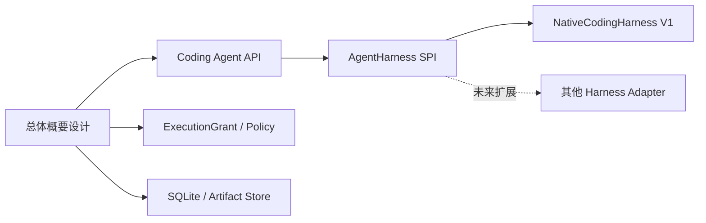

## 2. 设计目标与非目标

| 类型 | 内容 |
| --- | --- |
| 目标 | 将编码任务转换为可恢复的 Context → Plan → Implement → Verify → Diagnose/Repair → Handoff 闭环 |
| 目标 | 所有修改、命令、测试和结论均有真实执行证据 |
| 目标 | 模型只能提出结构化动作，策略层决定是否允许，执行器产生事实结果 |
| 目标 | 支持暂停、取消、崩溃恢复、有限自动修复和人工 Review |
| 目标 | V1 统一覆盖 React+TypeScript+Vite+Ant Design+PixiJS 与 Node.js+TypeScript+Fastify+TypeBox+Drizzle |
| 非目标 | 多 Agent 角色协作、云端多租户、自动生产发布、任意公网命令执行、自动批准高风险变更 |

## 3. 总体架构

### 3.1 组件架构

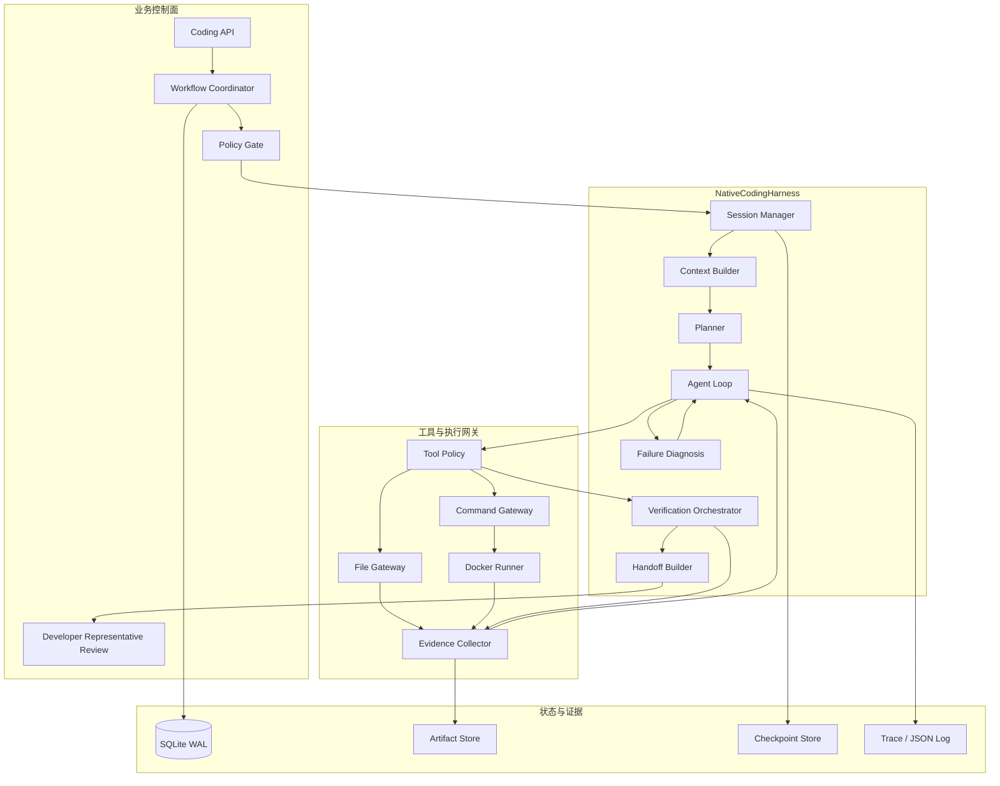

### 3.2 模块职责与边界

| 模块 | 输入 | 输出 | 允许做什么 | 明确禁止 |
| --- | --- | --- | --- | --- |
| `Coding API` | 用户命令、任务 ID、审批动作 | `202`、状态查询、SSE 事件 | 校验请求、鉴权、提交控制命令 | 直接调用模型、直接写工作区 |
| `Workflow Coordinator` | 任务状态、Harness 结果 | 状态转换、审批请求、后续任务 | 推进业务流程、写业务事件 | 将模型输出当作审批结果 |
| `Policy Gate` | 计划、ExecutionGrant、风险分类 | allow / reject / approval_required | 计算路径、命令、依赖和风险策略 | 修改文件、执行命令 |
| `Session Manager` | `CodingTaskSpec`、Grant | Session、Attempt、Checkpoint | 管理租约、暂停、恢复、取消 | 绕过事务和版本检查 |
| `Context Builder` | 工作区、任务、规则文件 | 分层上下文包 | 确定性扫描、相关文件选择、摘要 | 无差别读取整个仓库 |
| `Planner` | 上下文包、验收标准 | 结构化计划 | 给出文件范围、步骤、检查和风险 | 直接执行计划 |
| `Agent Loop` | 计划、Observation | `Action` | 选择下一步动作、维护短期记忆 | 伪造执行结果 |
| `Tool Gateway` | Action、Grant | Observation | 校验并执行授权工具 | 暴露任意路径、任意 shell |
| `Verification Orchestrator` | Patch、项目命令 | VerificationRun | 按阶梯执行检查并采集证据 | 跳过真实检查 |
| `Failure Diagnosis` | 失败 Observation、历史尝试 | FailureDiagnosis | 分类、提出最小修复假设 | 无依据扩大修改范围 |
| `Handoff Builder` | diff、验证、风险、日志引用 | HandoffPackage | 生成 Review 材料 | 自动批准或关闭缺陷 |

### 3.3 V1 技术实现边界

| 能力 | V1 实现 |
| --- | --- |
| Agent 形态 | 单 Agent、多阶段状态机 |
| Harness | `NativeCodingHarness` |
| 控制进程 | Node.js 22 LTS + TypeScript + Fastify + TypeBox |
| Worker | Node.js/TypeScript 独立进程，租约 + 心跳 |
| 模型适配 | TypeScript Model Adapter；默认经 AI SDK / `@ai-sdk/openai-compatible`，供应商可替换 |
| 执行环境 | Docker 非 root 容器，任务级工作区 |
| 业务状态 | SQLite WAL + Drizzle ORM + drizzle-kit |
| 大型证据 | 本地 Artifact Store，内容 SHA-256 |
| 观测 | OpenTelemetry JS + 结构化 JSON Log |
| 上下文检索 | 确定性扫描 + 任务相关检索；V1 不引入向量库 |

## 4. 生命周期、状态机与事件模型

### 4.1 主状态机

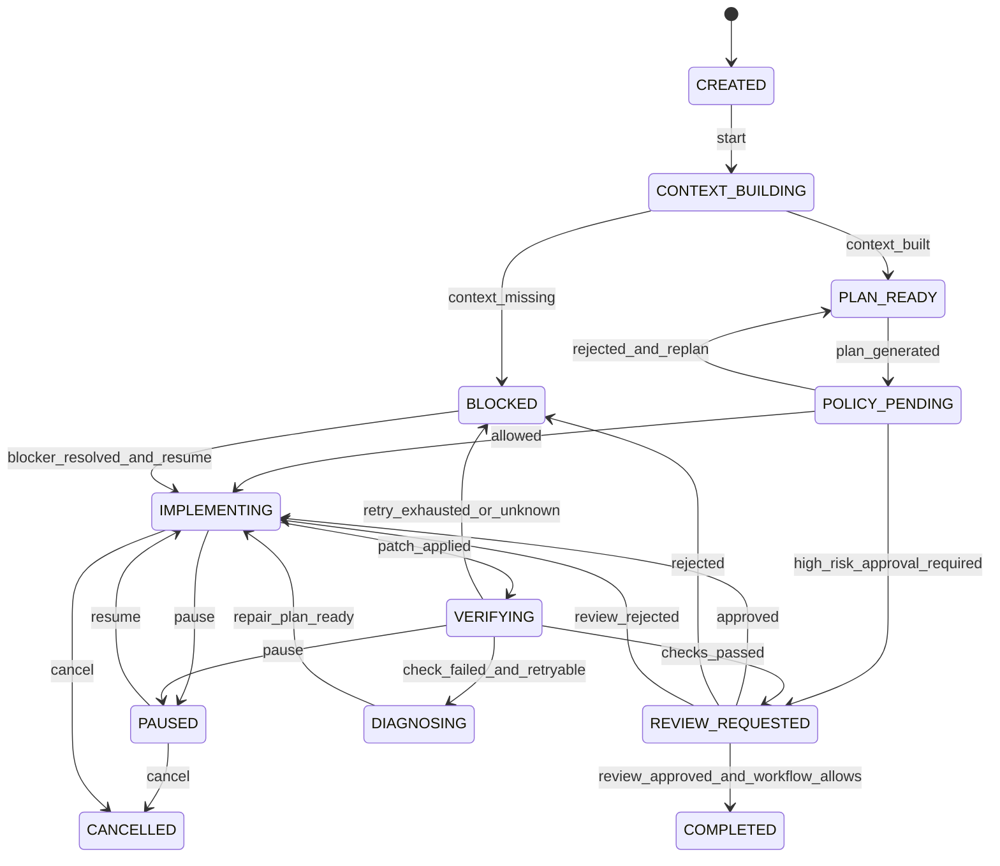

### 4.2 状态转换不变量

1. 只有 `Workflow Coordinator` 能改变业务任务状态；Harness 只能返回执行结果。
2. 只有存在对应 `ExecutionGrant`、未过期租约和工作区版本匹配时，才能进入 `IMPLEMENTING`。
3. 进入 `COMPLETED` 前必须存在成功的验证证据、完整 diff 和 Review 决策。
4. `PAUSED`、`BLOCKED`、`CANCELLED` 状态不得自动执行新的工具动作。
5. 每次状态转换必须原子写入状态版本、领域事件和 Outbox 记录。
6. 重放事件不会重复应用文件 patch、命令或外部模型调用；外部动作通过 `idempotencyKey` 去重。

### 4.3 领域事件

事件为追加写入、不可变、带版本的事实记录。核心事件包括：

`SessionCreated`、`ContextBuilt`、`PlanGenerated`、`PolicyEvaluated`、`ApprovalRequested`、`ApprovalDecided`、`ActionProposed`、`ActionAccepted`、`ActionRejected`、`ObservationRecorded`、`PatchApplied`、`VerificationStarted`、`VerificationFinished`、`FailureDiagnosed`、`CheckpointSaved`、`SessionPaused`、`SessionResumed`、`SessionBlocked`、`HandoffCreated`、`ReviewDecided`、`SessionCompleted`、`SessionCancelled`。

事件最小结构：

```json
{
  "eventId": "evt_01J...",
  "eventType": "ObservationRecorded",
  "aggregateType": "coding_session",
  "aggregateId": "ses_01J...",
  "aggregateVersion": 42,
  "occurredAt": "2026-08-12T10:20:30Z",
  "traceId": "tr_01J...",
  "actor": "native_coding_harness",
  "payloadRef": "artifact://events/evt_01J.json",
  "schemaVersion": 1
}
```

## 5. 执行时序与阶段设计

### 5.1 一次正常编码任务

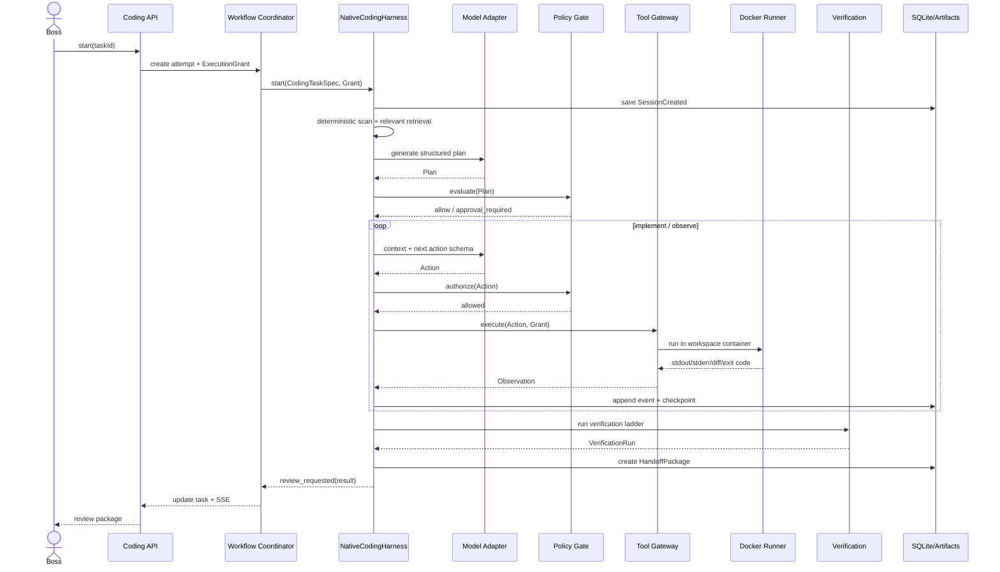

### 5.2 多阶段行为

| 阶段 | 进入条件 | 必须产物 | 离开条件 |
| --- | --- | --- | --- |
| `Context` | 任务已获租约 | `ContextPack`、扫描清单、缺失项 | 上下文完整或明确阻塞 |
| `Plan` | Context 完成 | `CodingPlan`、文件范围、验证命令、风险 | 结构校验通过 |
| `Policy` | 计划生成 | `PolicyDecision` | allow、需审批或拒绝 |
| `Implement` | 计划获准 | 分批 `PatchBatch`、Action/Observation | 一个 patch 完成或暂停/阻塞 |
| `Verify` | patch 已应用 | `VerificationRun`、证据引用 | 通过、可修复失败或阻塞 |
| `Diagnose/Repair` | 验证失败 | `FailureDiagnosis`、下一次最小修复计划 | 返回 Implement 或因达到上限进入 Blocked |
| `Handoff` | 验证满足交接条件 | `HandoffPackage` | 请求 Review，不自动完成 |

## 6. 核心数据对象与接口

### 6.1 `CodingTaskSpec`

```json
{
  "taskId": "task_01J...",
  "projectId": "project_01J...",
  "title": "增加登录表单校验",
  "goal": "提交前校验邮箱格式并展示错误提示",
  "acceptanceCriteria": ["非法邮箱不可提交", "错误提示可见", "现有测试不回归"],
  "workspaceRoot": "workspace://project_01J",
  "baselineCommit": "local-snapshot-sha",
  "allowedPaths": ["frontend/src/**", "frontend/tests/**"],
  "forbiddenPaths": [".env*", "secrets/**", "backend/migrations/**"],
  "stackProfile": "react-ts-vite",
  "verificationProfile": "frontend-default",
  "riskPolicy": "standard",
  "taskVersion": 3
}
```

### 6.2 `ExecutionGrant`

```json
{
  "grantId": "grant_01J...",
  "projectId": "project_01J...",
  "taskId": "task_01J...",
  "attemptId": "attempt_01J...",
  "role": "developer",
  "roleVersion": 1,
  "modelConfigVersion": 7,
  "modelProvider": "openai",
  "modelName": "configured-model",
  "workspaceGrant": {
    "root": "/workspace/project",
    "read": ["/workspace/project/**"],
    "write": ["/workspace/project/frontend/src/**"],
    "deny": ["**/.env*", "**/secrets/**"]
  },
  "toolPolicy": ["repo_scan", "read_file", "search_code", "apply_patch", "run_verification"],
  "commandPolicy": {"allow": ["npm test", "npm run build", "npm run lint"], "network": "deny"},
  "expiresAt": "2026-08-12T11:20:30Z",
  "policyVersion": 5,
  "traceId": "tr_01J..."
}
```

### 6.3 `Action` 与 `Observation`

```json
{
  "actionId": "act_01J...",
  "sessionId": "ses_01J...",
  "seq": 17,
  "type": "apply_patch",
  "input": {
    "path": "frontend/src/LoginForm.tsx",
    "baseFileSha256": "sha256:...",
    "patch": "*** Begin Patch ..."
  },
  "reason": "add email validation before submit",
  "idempotencyKey": "ses_01J:17:apply_patch",
  "requiresApproval": false
}
```

```json
{
  "observationId": "obs_01J...",
  "actionId": "act_01J...",
  "status": "succeeded",
  "exitCode": 0,
  "changedFiles": [{"path": "frontend/src/LoginForm.tsx", "before": "sha256:a", "after": "sha256:b"}],
  "stdoutRef": "artifact://stdout/obs_01J",
  "stderrRef": null,
  "diffRef": "artifact://diff/obs_01J",
  "durationMs": 382,
  "redactions": [],
  "traceId": "tr_01J..."
}
```

### 6.4 `NativeCodingHarness` SPI

```typescript
interface AgentHarness {
  start(spec: CodingTaskSpec, grant: ExecutionGrant): Promise<SessionHandle>;
  resume(sessionId: string, checkpointId: string): Promise<SessionHandle>;
  pause(sessionId: string, reason: string): Promise<void>;
  cancel(sessionId: string, reason: string): Promise<void>;
  stream(sessionId: string): AsyncIterable<AgentEvent>;
  result(sessionId: string): Promise<CodingExecutionResult>;
}
```

SPI 约束：Harness 不直接持有业务数据库写权限；持久化通过 `SessionRepository`、`EventStore`、`ArtifactStore` 接口完成；模型通过 `ModelAdapter`；工具通过 `ToolExecutor`；业务状态由 `Workflow Coordinator` 更新。

`modelConfigVersion` 在创建 Attempt 时固化。项目运行中切换领域模型只影响后续 Attempt；当前 Attempt 始终使用启动时的模型配置，并将提供商、模型、配置版本和调用链写入结果与交接包。

### 6.5 HTTP 接口声明

| 方法 | 路径 | 用途 | 幂等键 |
| --- | --- | --- | --- |
| `POST` | `/api/projects/{projectId}/coding-tasks` | 创建编码任务 | `Idempotency-Key` |
| `POST` | `/api/coding-sessions` | 启动 Harness Attempt | `taskId + taskVersion` |
| `GET` | `/api/coding-sessions/{sessionId}` | 查询当前状态和摘要 | 无 |
| `GET` | `/api/coding-sessions/{sessionId}/events` | SSE 事件流 | `Last-Event-ID` |
| `POST` | `/api/coding-sessions/{sessionId}/pause` | 暂停 | `commandId` |
| `POST` | `/api/coding-sessions/{sessionId}/resume` | 从 checkpoint 恢复 | `checkpointId` |
| `POST` | `/api/coding-sessions/{sessionId}/cancel` | 取消 | `commandId` |
| `GET` | `/api/coding-sessions/{sessionId}/handoff` | 获取交接包 | 版本号 |
| `POST` | `/api/handoffs/{handoffId}/review` | 开发代表 Review | `reviewId` |

启动响应示例：

```json
{
  "sessionId": "ses_01J...",
  "attemptId": "attempt_01J...",
  "status": "context_building",
  "leaseExpiresAt": "2026-08-12T11:20:30Z",
  "eventStream": "/api/coding-sessions/ses_01J.../events"
}
```

## 7. 上下文工程

### 7.1 构建顺序

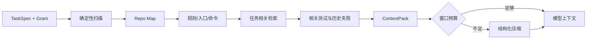

### 7.2 确定性扫描规则

扫描优先读取目录树、`package.json`、锁文件、`tsconfig.json`、`vite.config.*`、`vitest.config.*`、`playwright.config.*`、`Dockerfile`、测试配置、项目规则文件和入口文件。扫描结果包含路径、文件 SHA、语言、入口、包管理器、可执行验证命令和禁止目录。

相关检索按以下顺序缩小范围：任务关键词 → 导出符号/路由/组件 → 调用方和被调用方 → 相关测试 → 最近失败证据。模型可以补充相关性判断，但不能覆盖路径授权和规则文件结论。

### 7.3 上下文压缩

压缩必须保留：任务目标、验收标准、已批准约束、已读文件、已改文件、当前 diff 摘要、执行过的命令、失败分类、根因假设、剩余风险、下一动作、证据引用和 checkpoint ID。压缩不会删除原始事件或证据。

## 8. Patch 事务与文件变更设计

### 8.1 Patch-first 原则

Agent 不直接覆盖文件。每次写入都提交一个小型 `PatchBatch`，包含基线文件 SHA、目标路径、统一 diff、预期变更摘要和 patch 序号。执行器在应用前重新计算 SHA；版本不匹配则拒绝并要求重新读取。

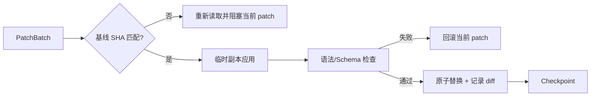

### 8.2 事务规则

- 一个 PatchBatch 只允许修改有限文件数和有限字节数；超过阈值转人工审批。
- Patch 应用失败不得留下半写文件；使用临时文件、fsync 和原子 rename。
- 每次 patch 都保存 before/after SHA、完整 diff、应用时间、工具版本和 traceId。
- 自动修复只回滚当前 patch，不删除历史成功 patch；任务取消时保留工作区和交接证据。
- 生成物目录、依赖缓存和测试输出不得误判为业务源代码变更。

## 9. 工具协议与执行隔离

### 9.1 V1 工具集合

| 工具 | 作用 | 默认权限 |
| --- | --- | --- |
| `repo_scan` | 扫描目录、技术栈、入口和验证命令 | 只读 |
| `read_file` | 读取授权路径文件 | 只读 |
| `search_code` | 在授权路径内按文本/符号检索 | 只读 |
| `apply_patch` | 事务化应用小批量 diff | 受限写 |
| `run_verification` | 执行预定义格式、类型、构建、测试 | 受限执行 |
| `save_evidence` | 固化输出、diff、测试报告和摘要 | 追加写 |

V1 默认不向模型暴露任意 `shell`。如确需命令，必须先由项目 `VerificationProfile` 将命令解析成允许项，并通过 `Command Gateway` 执行。

### 9.2 Docker 工作区

每个 `attemptId` 建立独立工作区和容器。容器使用非 root 用户、只读基础镜像、限定 CPU/内存/磁盘/执行时间；工作区以最小路径挂载。默认网络关闭，依赖安装需开发代表批准并只能写入任务容器缓存。

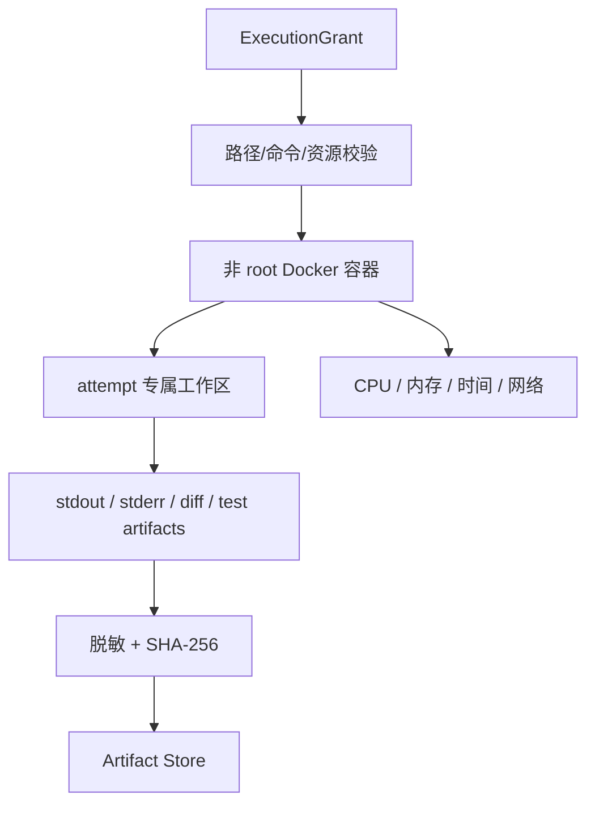

### 9.3 工具拒绝

拒绝原因必须结构化为 `PATH_DENIED`、`COMMAND_DENIED`、`GRANT_EXPIRED`、`RESOURCE_LIMIT`、`NETWORK_DENIED`、`SECRET_ACCESS_DENIED`、`BASE_VERSION_MISMATCH` 或 `APPROVAL_REQUIRED`。拒绝也是 Observation，但不得自动当作代码缺陷重试。

## 10. 验证、失败诊断与重试

### 10.1 验证阶梯

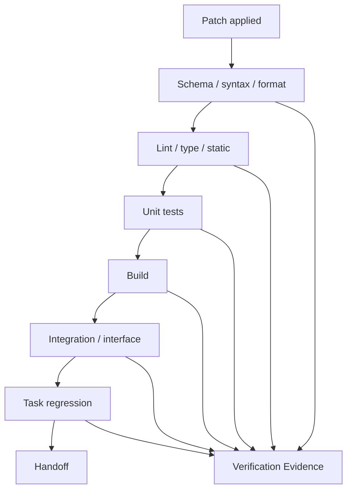

实际阶梯由技术栈 Profile 决定。前端默认关注 lint、TypeScript、单测、Vite build；后端默认关注 ESLint/格式、TypeScript 类型检查、Vitest、接口测试和 Drizzle migration 检查。

### 10.2 失败分类

| 类别 | 例子 | 自动动作 |
| --- | --- | --- |
| `CODE_DEFECT` | 断言失败、类型错误、编译错误 | 允许诊断和修复 |
| `TEST_FLAKE` | 同一输入偶发超时、非确定失败 | 一次复跑后再判定 |
| `ENVIRONMENT` | 容器缺包、端口冲突、资源超限 | 尝试受策略允许的环境修复，否则阻塞 |
| `POLICY` | 越权路径、命令或网络请求 | 立即阻塞，不以代码修复重试 |
| `CREDENTIAL` | API Key 缺失或泄露风险 | 阻塞并请求凭据配置 |
| `UNKNOWN` | 无法建立根因 | 阻塞并交接人工 |

### 10.3 重试上限

- 同一失败类型最多自动修复 2 次。
- 单个 Attempt 总自动修复最多 3 次。
- 每次修复必须改变诊断假设或 patch；禁止原动作盲目重复。
- 达到上限生成 `FailureReport`，状态进入 `BLOCKED`，保留全部日志、diff 和验证证据。
- 安全拒绝、凭据问题、工作区越界、高风险配置、外部服务不可用和未知根因不进入代码自动重试。

## 11. 高风险策略与人工关卡

### 11.1 风险分类

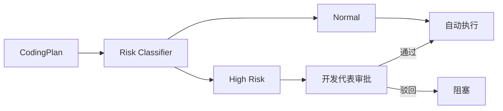

以下变更默认高风险：新增或升级依赖、Dockerfile/构建配置、数据库迁移、认证授权、安全策略、批量删除或大范围重命名、写入禁止目录、开启网络、修改凭据配置和超出任务路径的文件变更。

高风险审批请求至少展示：变更摘要、涉及文件、命令与网络、风险理由、预计副作用、回滚方案、当前证据和策略版本。开发代表只能批准计划；批准后仍需逐动作执行校验。

## 12. 持久化、检查点与恢复

### 12.1 存储分工

| 数据 | 存储 | 规则 |
| --- | --- | --- |
| Session/Attempt 当前状态 | SQLite | 事务写入，WAL，版本号 |
| 领域事件 | SQLite 事件表 + 大 payload Artifact | 追加不可变 |
| Checkpoint | SQLite 元数据 + Artifact 上下文 | 可从最近安全点恢复 |
| Diff/日志/测试输出 | Artifact Store | SHA-256、内容寻址、保留策略 |
| 模型凭据 | OS Keychain | SQLite 仅存 `secretRef` |
| Trace/指标 | JSON Log / OpenTelemetry | 脱敏、按 trace 关联 |

### 12.2 Checkpoint 内容

```json
{
  "checkpointId": "chk_01J...",
  "sessionId": "ses_01J...",
  "state": "verifying",
  "taskVersion": 3,
  "workspaceSnapshot": "sha256:...",
  "currentPlanRef": "artifact://plans/plan_01J",
  "completedActionSeq": 21,
  "pendingAction": null,
  "contextSummaryRef": "artifact://context/chk_01J",
  "retryCounters": {"CODE_DEFECT": 1, "TEST_FLAKE": 0},
  "lastEvidenceRefs": ["artifact://test/run_01J"],
  "createdAt": "2026-08-12T10:25:30Z"
}
```

### 12.3 恢复流程

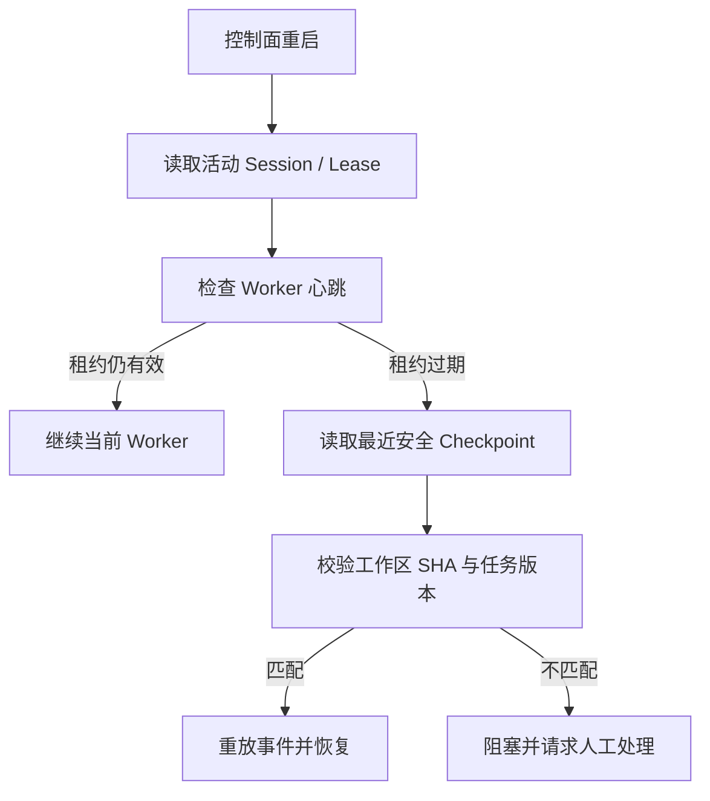

恢复不重放已完成的 `apply_patch` 或外部副作用动作；通过 `idempotencyKey`、工作区 SHA 和事件序号判断是否已完成。

## 13. 可观测性与用户可见性

每个 Session、Attempt、Action、Tool、VerificationRun 和 Handoff 共享 `traceId`，并使用 `spanId` 表示嵌套调用。结构化日志记录开始/结束时间、状态、耗时、策略版本、模型版本、Token/成本、退出码、重试次数和证据引用。

Boss 视图只展示阶段、进度、阻塞原因、审批请求、关键产物和下一步；开发代表控制台可查看 Action/Observation、文件、patch、命令、输出、测试和 trace。任何界面、日志、事件、Artifact 和备份均不得展示 API Key、完整系统提示词或模型内部推理文本。

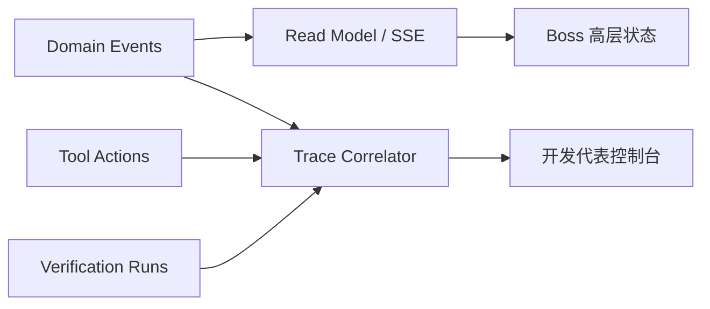

## 14. 安全设计

### 14.1 安全边界

- 用户输入、网页内容、仓库文件和测试输出均按不可信数据处理；不得改变 Agent 角色、策略和系统指令。
- 所有文件、命令、网络和凭据能力由 `ExecutionGrant` 明确授予；默认拒绝。
- `.env`、密钥目录、Keychain、SSH 配置、系统目录和工作区外路径默认拒绝。
- 模型上下文只接收脱敏后的凭据引用和必要元数据，不接收明文凭据。
- 任务容器隔离网络和资源；取消、超时、异常时回收进程和租约。
- 安全策略拒绝不允许通过修改代码绕过；必须由人工改变策略或授权。

### 14.2 凭据流

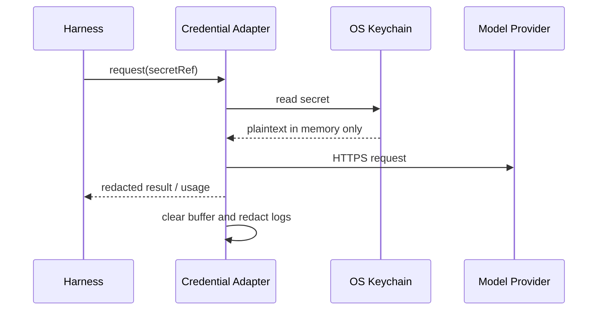

凭据缺失、连接失败或疑似泄露时，Session 进入 `BLOCKED`，不得用模型上下文、错误信息或日志回显凭据。

## 15. 结果交接与 Review

### 15.1 `HandoffPackage`

```json
{
  "handoffId": "handoff_01J...",
  "sessionId": "ses_01J...",
  "status": "review_requested",
  "summary": "完成邮箱格式校验并补充测试",
  "changedFiles": ["frontend/src/LoginForm.tsx", "frontend/src/LoginForm.test.tsx"],
  "diffRef": "artifact://diff/handoff_01J",
  "verificationRuns": ["artifact://verification/run_01J"],
  "commands": ["npm run lint", "npm test -- --run"],
  "remainingRisks": [],
  "knownFailures": [],
  "rollback": {"workspaceSnapshot": "sha256:...", "patchSeq": [1, 2]},
  "traceId": "tr_01J..."
}
```

### 15.2 Review 决策

Review 只能产生 `approved`、`changes_requested`、`blocked` 三类结果。`approved` 仅表示开发代表接受交付物，不代表测试放行；测试放行和项目结项仍由总体工作流的测试门禁与 Boss 决策完成。

## 16. 技术栈 Profile

### 16.1 前端 `react-ts-vite`

```yaml
scan: [package.json, tsconfig.json, vite.config.*]
checks:
  - npm run lint
  - npm run typecheck
  - npm test -- --run
  - npm run build
network: deny
```

### 16.2 后端 `node-fastify-ts`

```yaml
scan: [package.json, package-lock.json, tsconfig.json, src/server.ts, tests/]
checks:
  - npm run lint
  - npm run typecheck
  - npm test -- --run
  - npm run db:check
network: deny
```

Profile 是可版本化配置，不由模型临时生成。任务可选择 Profile，但不能扩大其允许路径、命令和网络权限。

## 17. 测试设计

| 层级 | 重点 |
| --- | --- |
| 单元测试 | 状态转换不变量、Grant 匹配、命令解析、脱敏、重试计数、Schema 校验 |
| Harness 集成测试 | Model Adapter、Tool Gateway、Checkpoint、事件追加、结果归一化 |
| Sandbox 测试 | 路径越界、命令拒绝、网络关闭、资源超限、非 root、取消回收 |
| 恢复测试 | Worker 崩溃、控制面重启、租约过期、工作区 SHA 不一致、幂等重放 |
| 验证测试 | 前后端 Profile、失败分类、阶梯顺序、证据完整性、Review 路由 |
| 安全测试 | Prompt Injection、凭据回显、符号链接逃逸、恶意 patch、日志脱敏 |
| 端到端 | 创建任务→计划→审批→修改→验证→Review→测试放行；桌面模式下由 Electron sidecar 提供启动与恢复宿主 |

最小验收场景：正常小改动、测试失败后修复、超出范围阻塞、高风险依赖审批、凭据缺失阻塞、暂停恢复、Worker 崩溃恢复、取消任务后保留证据。

总体需求矩阵中的 `AS-17` 是本专项设计的主验收样本：正常开发 1 次、Review 驳回 1 次、测试失败/NPI 修复 1 次、中断恢复 1 次；每次执行均需验证状态、证据、权限和追踪链。桌面安装、sidecar 和升级保数据由 `AS-18`/DEV-11 验收，本专项只提供被托管的执行能力。

## 18. 需求追踪与实现拆分

| 设计章节 | 主要需求 |
| --- | --- |
| §3～§5 架构、状态、时序 | SR-COD-001/002/003/004、SR-EXE、SR-WFL |
| §6 接口与对象 | SR-COD-005/006/007、SR-EVT、SR-OBS |
| §7～§10 上下文、Patch、工具、验证 | SR-COD-003/004/005/006/008、SR-SEC、SR-REL |
| §11 高风险与人工关卡 | SR-COD-009/012、SR-SEC、SR-APR |
| §12～§14 持久化、观测、安全 | SR-COD-010/011、SR-DAT、SR-ARC、SR-NFR |
| §15～§17 交接、Profile、测试 | SR-COD-007/012、SR-EVL、PRD AC-26 |

## 19. 后续实现输入

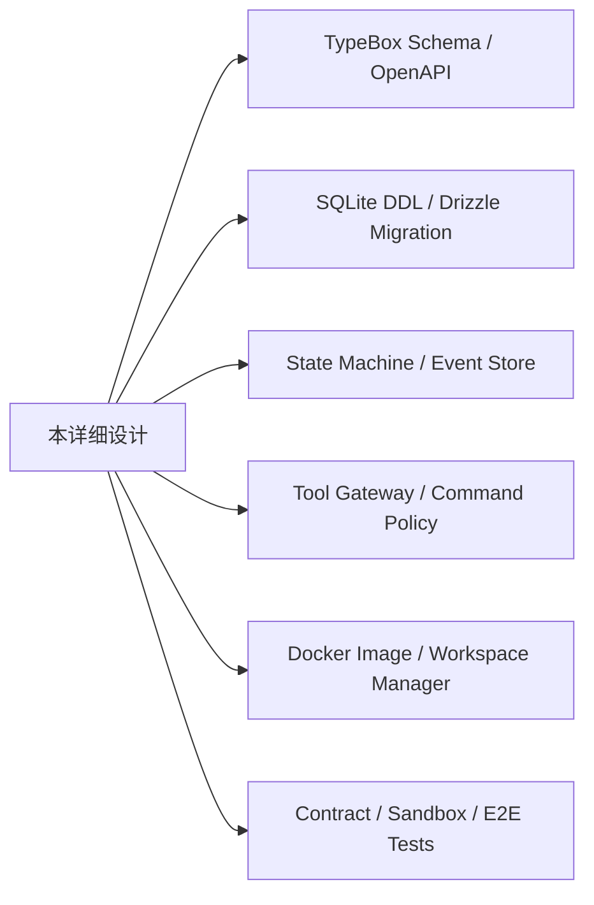

实现顺序建议：先完成对象 Schema、事件和状态机；再完成 Workspace/Tool Gateway 与事务 Patch；随后接入 Verification Profile、Checkpoint/恢复和 Model Adapter；最后接入 UI 的 SSE 投影、Review 页面和端到端验收。
