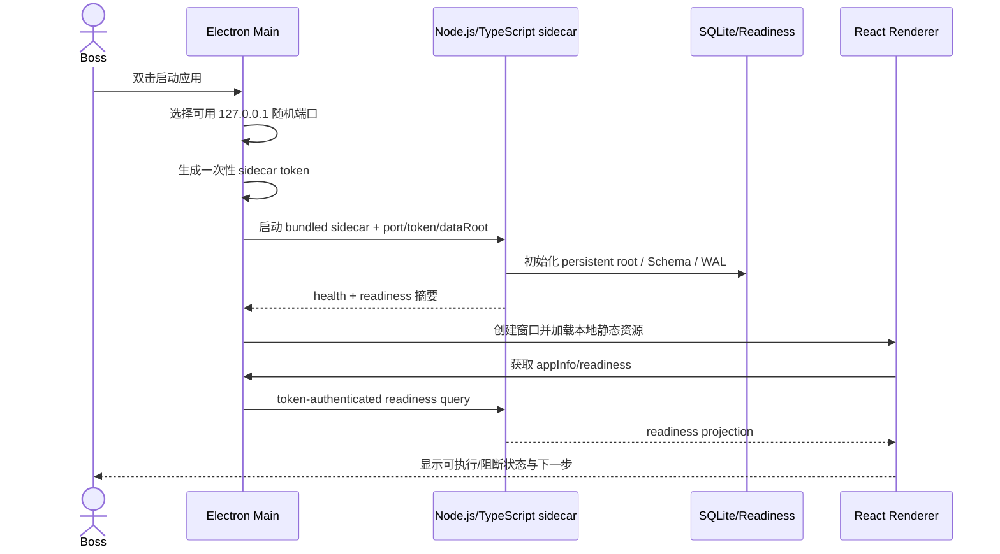
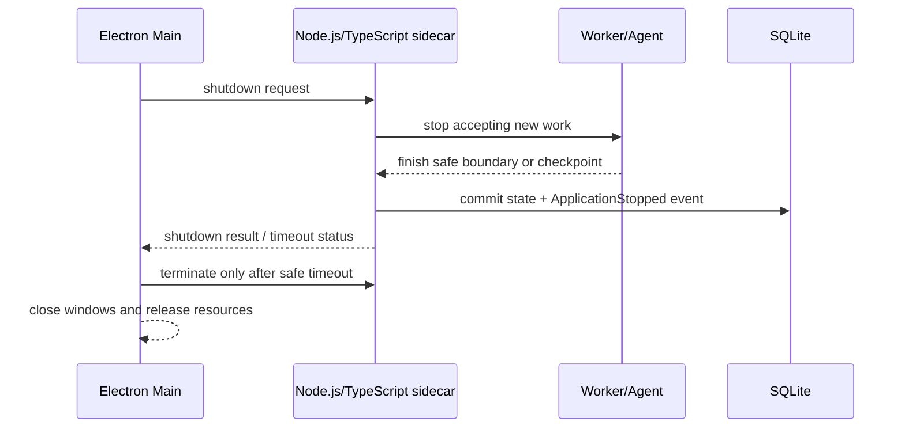

# Digital Harness V1 Electron 桌面应用详细设计

> 版本：V1.0-draft
> 状态：已纳入 V1 P1 方案，待实现与跨平台验收
> 上游：[PRD V1](../PRD/PRDv1.md)、[软件开发需求矩阵 V1.6-draft](../requirement/software-requirements-matrix-v1.md)、[工程概要设计 V0.6-draft](./high-level-design-v1.md)
> 下游任务：[DEV-11](../task/task11.md)

## 1. 目标与边界

本设计把现有 React/Vite 前端和 Node.js/TypeScript + Fastify 控制面交付为可安装的 macOS/Windows 本地桌面应用，提供接近 Codex 类本地 Agent 产品的启动、线程、任务、工作区、执行证据和恢复体验。

V1 采用：

```text
Electron Main + Preload
        ↓
React/Vite Renderer
        ↓
Node.js/TypeScript + Fastify sidecar
        ↓
SQLite / Keychain / Agent Worker / Docker Engine
```

本设计不声称复制 Codex 的实现、品牌、内部服务或沙箱；只冻结本项目的桌面进程、数据、权限、启动、升级和验收边界。

本设计不改变以下既有边界：

- 单机、单 Boss、同一时刻一个活动项目；
- 默认只允许本机访问；
- 业务事实由 Node.js/TypeScript 控制面、领域状态、事件、执行记录和 Artifact Store 保存；
- Renderer 不直接访问数据库、Keychain、Docker 或任意系统命令；
- Docker 是受控代码/构建/测试执行依赖，不是 Electron、前端或 sidecar 的强制运行包装方式；
- Task 1 已完成的是运行时基础设施，DEV-11 负责桌面化交付，二者不混为同一个完成声明。

## 2. 需求追踪

| 设计主题 | 需求 | 验收 |
| --- | --- | --- |
| 安装包与平台 | `SR-DESK-001` | `AS-18`：macOS/Windows 安装包、架构提示 |
| Electron 启动与窗口 | `SR-DESK-002/003` | `AS-18`：双击启动、自动拉起 sidecar、正常退出和异常提示 |
| 安全 IPC 与本机控制面 | `SR-DESK-004/005/010/012` | `AS-16`、`AS-18`：目录、凭据、诊断和版本信息 |
| readiness 与 Docker 降级 | `SR-DESK-006/007` | `AS-02`、`AS-09`、`AS-18`：缺失依赖阻断和恢复 |
| 升级、重启与恢复 | `SR-DESK-008/009` | `AS-10`、`AS-15`、`AS-18`：数据保留和不越过关卡 |
| 桌面可用性 | `SR-DESK-011` | `AS-14`、`AS-18`：视口走查和非专业用户理解 |
| 产品验收 | PRD `AC-27` | `AS-18` 端到端桌面交付闭环 |

## 3. 进程与组件架构

### 3.1 进程职责

| 组件 | 进程 | 责任 | 允许通信 |
| --- | --- | --- | --- |
| Electron Main | 桌面主进程 | 应用窗口、sidecar 生命周期、安装/升级状态、诊断、白名单 IPC 路由 | Preload、sidecar health/control API |
| Preload | 每个窗口的受控桥 | 只暴露类型化的最小桌面 API | Renderer ↔ Main |
| React/Vite Renderer | Chromium 渲染进程 | UI、查询缓存、事件投影、Diff/日志/审批展示 | 仅调用 `window.desktopRuntime` |
| Node.js/TypeScript + Fastify sidecar | Electron 子进程 | 业务 API、持久化、readiness、StartupGate、Worker/Agent 接入 | Main token-authenticated localhost API |
| Node.js/TypeScript Worker | sidecar 管理的子进程或后续受控 Worker | 任务执行、租约、Agent、证据回传 | sidecar 内部协议 |
| Docker Engine | 外部本机 runtime | 隔离执行代码、构建和测试 | 由 sidecar/Worker 经过策略层调用 |

### 3.2 启动时序



启动要求：

1. sidecar 没有返回健康状态前，不显示“应用已就绪”；
2. readiness blocked 只阻断受影响的真实动作，允许查看可查询数据；
3. sidecar 启动失败保留诊断窗口和 traceId，不自动切换到伪造数据；
4. 启动期间不得执行真实模型、网页、工作区命令或项目任务；
5. Electron 关闭窗口必须进入明确的 sidecar shutdown 流程。

### 3.3 关闭与异常时序



若 sidecar 无法在安全超时内退出，Electron 记录脱敏诊断并终止子进程；下次启动由 sidecar 按现有 Worker lease、checkpoint 和项目状态规则恢复，不能自动把等待 Boss/暂停/阻塞状态改为运行中。

## 4. IPC 与 sidecar API 边界

### 4.1 Renderer 白名单 API

Preload 只暴露类型化接口，示意如下：

```typescript
interface DesktopRuntimeBridge {
  getAppInfo(): Promise<{
    appVersion: string;
    sidecarVersion: string;
    schemaRevision: string;
    platform: string;
    arch: string;
  }>;
  getReadiness(): Promise<ReadinessView>;
  selectWorkspace(): Promise<WorkspaceSelection | null>;
  openDiagnosticFolder(): Promise<void>;
  subscribeEvents(listener: (event: RuntimeEvent) => void): () => void;
}
```

项目、线程、任务、审批和 Agent 命令也必须通过明确命名的接口暴露，例如 `createProject`、`startTask`、`pauseTask`、`approveTask`；禁止提供通用的 `execute(command)`、`readFile(path)` 或 `request(url)` 桥。

### 4.2 Electron 安全配置

每个 BrowserWindow 固定：

```text
contextIsolation: true
nodeIntegration: false
sandbox: true
webSecurity: true
```

生产环境只加载应用内置的 Vite 静态资源；开发环境可以加载受控的 Vite dev server，但不能因开发代理而修改生产的权限边界。Renderer 不拥有 Node 权限，所有系统能力必须经过 Main/Preload 白名单。

### 4.3 sidecar 认证

- Main 为每次启动生成至少 256 bit 的随机 token；
- token 只通过子进程启动环境传入，不写入业务数据库、日志或前端状态；
- sidecar 绑定 `127.0.0.1` 的随机可用端口，并要求每次请求携带 token；
- token 失效、sidecar 停止或来源不符合策略时返回 `403 POLICY_DENIED`；
- 业务高风险操作仍必须经过 StartupGate、Workflow/Policy Gate、必要的 Boss 二次确认和审计；
- 诊断摘要只能返回 token 无关的脱敏信息。

## 5. 数据目录、安装和升级

### 5.1 安装目录与数据目录

安装目录只保存程序资源：

```text
Electron 主程序
React/Vite 静态资源
Node.js/TypeScript sidecar
内置 schema/profile/runtime 资源
```

业务数据使用 Electron `app.getPath('userData')` 的产品子目录，或由用户/运维配置覆盖：

```text
macOS:
~/Library/Application Support/DigitalCompany/

Windows:
%APPDATA%\\DigitalCompany\\
```

目录内部保持：

```text
company.db
company.db-wal
company.db-shm
artifacts/
traces/
workspaces/
backups/
manifest.json
```

代码目录、安装目录、Electron 临时目录和 Docker 临时容器层不得承担业务持久化。

### 5.2 升级规则

1. 安装包升级前检查应用版本、sidecar 版本和 Schema revision；
2. 先创建可验证的一致性备份，再执行兼容 migration；
3. 兼容版本允许升级并保留项目、任务、事件、产物和状态；
4. 未知/高版本/不兼容 Schema 进入可查询的只读/blocked 模式，不覆盖旧数据；
5. 凭据不随安装包、业务备份或数据库迁移，升级后仍通过 OS Keychain 的 `secretRef` 访问；
6. 卸载默认不删除用户数据，用户若要删除必须经过明确的独立数据删除流程；
7. 升级和回滚必须记录应用版本、Schema revision、结果、操作者/触发来源和 traceId。

## 6. Docker 与执行运行时

桌面应用与 Docker 的关系保持如下：

```text
Electron + React/Vite + Node.js/TypeScript sidecar
                 │
                 └── StartupGate / Worker
                         │
                         └── Docker Engine/Desktop
                                 │
                                 └── 非 root、任务级工作区、资源/网络受限容器
```

readiness 只检查 Engine/API 能力、非 root、授权工作区挂载、资源限制和网络策略；它不启动真实业务任务容器。真实任务执行必须经过 `ExecutionGrant`/`CodingExecutionGrant`、Workspace Manager 和 Docker Runner。

Docker 不可用时：

- 应用窗口、项目列表、历史、事件和非执行查询仍可用；
- 需要容器隔离的代码修改、构建、测试和 Agent 任务返回明确阻断；
- 阻断不删除数据、不伪造成功、不自动切换到宿主机任意命令执行；
- Docker 恢复后重新执行 readiness，只有门禁恢复才允许后续动作。

## 7. 打包与发布边界

### 7.1 构建产物

V1 目标产物：

| 平台 | 最低目标 | 产物 |
| --- | --- | --- |
| macOS | arm64、x64 | `.app`、`.dmg` |
| Windows | x64 | 安装 `.exe`；可选 `.msi` |

macOS arm64/x64 与 Windows x64 的 Electron 主程序、Node.js/TypeScript sidecar 和原生依赖必须在对应平台构建和验证；不把跨平台交叉编译当作验收证据。

### 7.2 构建工具选择

桌面实现冻结 Electron，但具体打包工具采用可替换边界。DEV-11 第一阶段建议使用 `electron-builder` 管理 `.app/.dmg/.exe`，使用 `tsup`/`esbuild` 生成 TypeScript sidecar bundle，并随应用携带经过固定版本的 Node.js runtime。工具版本、签名、公证、安装包哈希和构建环境必须写入发布证据。

### 7.3 签名与供应链

正式外发前必须补充：

- macOS Developer ID 签名与 notarization；
- Windows Authenticode 签名；
- Electron、sidecar 和资源文件的版本/哈希清单；
- 安装包来源和构建环境记录；
- 自动更新若启用，必须验证签名、回滚和数据兼容性。

V1 开发验收可以先使用未签名本地安装包，但未签名包不能标记为面向用户的正式发布版本。

## 8. 失败处理与诊断

| 阶段 | 失败 | UI 行为 | 数据行为 |
| --- | --- | --- | --- |
| Electron 启动 | 主进程/资源加载失败 | 显示安装版本、平台、日志位置和 traceId | 不写业务状态 |
| sidecar 启动 | 进程退出、端口冲突、token 握手失败 | 显示控制面不可用和重试/诊断入口 | 已提交数据保留 |
| readiness | 模型、调研、工作区、Docker、持久化 blocked | 展示影响、数据保留和下一步 | 不启动真实执行 |
| 任务执行 | Worker/Docker/模型失败 | 任务阻塞或进入可恢复状态，展示证据 | 保存 checkpoint、事件、错误和 artifact |
| 升级 | Schema 不兼容 | 保持查询/只读，提供升级处理说明 | 不覆盖旧库、不删除数据 |
| 关闭 | sidecar 超时 | 提示下次启动将执行恢复检查 | 安全边界提交状态；不越过人工关卡 |

## 9. 测试与验收

### 9.1 自动化测试

- Main：窗口创建、单实例、sidecar 命令行、端口选择、token 不落盘、退出码处理；
- Preload：只暴露白名单 API，Renderer 无 Node/任意命令能力；
- sidecar：token 校验、health/readiness、关闭、版本和 Schema 响应；
- 集成：桌面启动 → sidecar 就绪 → readiness 展示 → Docker blocked/ready 切换；
- 数据：升级前后 SQLite/Artifact/Trace/manifest 一致，Keychain 明文不进入包；
- 恢复：运行中、等待 Boss、暂停和阻塞状态重启后不越过门禁；
- 安全：本机随机端口、token 泄露扫描、路径边界、Renderer 隔离、诊断脱敏。

### 9.2 跨平台验收矩阵

| 场景 | macOS arm64 | macOS x64 | Windows x64 |
| --- | --- | --- | --- |
| 安装与卸载 | 必须 | 必须 | 必须 |
| 双击启动和自动 sidecar | 必须 | 必须 | 必须 |
| readiness 全部 ready | 必须 | 必须 | 必须 |
| Docker blocked/恢复 | 必须 | 必须 | 必须 |
| 关闭和重启恢复 | 必须 | 必须 | 必须 |
| 兼容升级保数据 | 必须 | 必须 | 必须 |
| Keychain/Credential Manager 边界 | 必须 | 必须 | 必须 |
| 安装目录/用户数据目录分离 | 必须 | 必须 | 必须 |
| 1280×720/1440×900 视口 | 必须 | 必须 | 必须 |

## 10. 未纳入本设计的能力

- Linux 桌面发行版；
- Windows ARM64 第一阶段支持；
- 云端 Agent、多人协作、多租户和远程访问；
- GitHub、Pull Request、CI/CD 和生产部署；
- 不受控的宿主机任意命令执行；
- 复制 Codex 的内部服务、沙箱实现或品牌/界面资源。
