# Digital Harness V1 概要设计

> 版本：V0.6-draft  
> 状态：图驱动概要设计，已纳入 Electron 桌面交付边界，待评审  
> 上游：[PRD V1](../PRD/PRDv1.md)、[软件开发需求矩阵 V1.6-draft](../requirement/software-requirements-matrix-v1.md)  
> 设计边界：macOS/Windows 桌面应用、单机、单 Boss、单活动项目、本地真实执行

## 1. 设计说明

本文件只保留概要设计所需的架构图、模块图、协作图、流程图、状态图、接口声明和技术选型。产品目标、用户故事、业务规则和验收原文以 PRD 与需求矩阵为准。

## 2. 技术基线

### 全项目实现语言原则

本项目**主要使用 TypeScript 开发**，并将 TypeScript 作为默认实现语言。项目级目标是让 TypeScript 占生产源代码的 95% 以上，在工程成熟和依赖稳定后尽量达到 98% 以上。前端、Electron Main/Preload/Renderer、共享类型与协议、应用编排、工具层、开发脚本和测试代码，凡是 TypeScript 能够满足要求的部分，都必须优先使用 TypeScript 实现。

只有在 TypeScript 无法满足目标，或平台/运行时强制要求、必须依赖成熟且暂无等价替代的其他语言生态、原生库或性能能力时，才允许使用其他语言。每个非 TypeScript 实现都必须在对应的详细设计或 Task 中记录选择原因、职责边界、接口契约和后续替换/收敛策略；不得因为个人熟悉度、短期编码便利或缺少类型建模而引入其他语言，也不得让例外语言向相邻模块无理由扩散。当前 V1 的控制面、流程编排、执行面和桌面 sidecar 均按 TypeScript/Node.js 方案设计，不预设非 TypeScript 的后端例外。

### 2.1 前端 UI 技术分层

前端技术不作为一个平铺的“技术包”使用，而是按页面职责分层。核心框架负责运行和组织页面，业务组件负责常规管理界面，PixiJS 只负责像素场景，服务端状态和本地 UI 状态分别管理。

| 前端层级 | 技术选型 | 负责内容 | 选型状态 |
| --- | --- | --- | --- |
| 前端核心 | React 18 + TypeScript + Vite | React 组件运行、TypeScript 类型约束、Vite 本地开发与构建 | 核心依赖 |
| 业务组件 | Ant Design | 表格、表单、抽屉、弹窗、通知、标签、分页、日期和配置页面 | 推荐组件库，可替换 |
| 服务端状态 | TanStack Query | 项目、任务、审批、通知、交付物、调用记录和历史项目的查询、缓存、刷新和失效 | 推荐依赖 |
| 本地 UI 状态 | React State / Zustand | 当前页面、抽屉、筛选、选中对象、视图模式、SSE 连接状态等非业务状态 | Zustand 可选 |
| 像素场景 | PixiJS | 像素办公室的背景、人物、工位、点击热区、缩放和平移动画 | V1 像素办公室的场景引擎 |
| 实时更新 | Server-Sent Events + TanStack Query | 接收后端状态事件，使看板、通知、办公室和调用控制台刷新 | 前后端通信约束 |

前端模块与技术的对应关系：

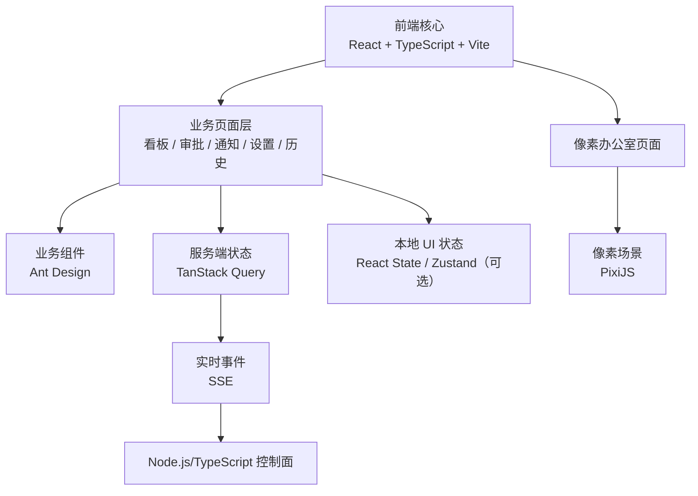

### 2.2 前端核心技术边界

```text
React + TypeScript + Vite
    ├── 负责：页面、组件、路由、类型、构建和开发服务器
    ├── 不负责：业务状态机、模型调用、文件操作和项目流程推进
    └── 通信：通过 REST Command / Query 和 SSE Event 与后端交互

Ant Design
    ├── 用于：普通业务管理页面
    ├── 不用于：替代项目视觉设计或实现像素办公室
    └── 可替换：更换组件库不应影响后端接口和业务模块边界

PixiJS
    ├── 用于：像素办公室的绘制、动画、缩放和平移
    ├── 输入：OfficeView 查询投影和状态事件
    ├── 输出：点击员工、工位和部门后的对象定位事件
    └── 不负责：保存项目状态、决定员工状态或推进工作流
```

### 2.3 后端技术分层

后端技术按“控制面、流程治理、执行面、外部适配、数据与观测”分层。Node.js/TypeScript 控制面负责业务入口和协调，LangGraph.js 负责流程，TypeScript Worker 负责真实执行，基础设施只提供存储、凭据和观测能力。

| 后端层级 | 技术选型 | 负责内容 | 选型状态 |
| --- | --- | --- | --- |
| 后端核心 | Node.js 22 LTS + TypeScript + Fastify + TypeBox + OpenAPI | REST、SSE、业务服务、命令校验、事务协调 | 核心依赖 |
| 流程治理 | LangGraph.js + 显式状态机 | 固定流程、人工关卡、任务依赖、恢复检查点、质量门禁 | 核心依赖 |
| 执行进程 | Node.js/TypeScript 独立 Worker | 领取租约、启动员工运行时、心跳、取消和结果回传 | 核心依赖 |
| 模型适配 | TypeScript Model Adapter + AI SDK / `@ai-sdk/openai-compatible` | 模型调用、统一错误、Token、成本和重试记录 | 推荐适配层，可替换 |
| 调研适配 | Playwright for Node.js + TypeScript Research Adapter | 受控网页访问、来源元数据采集、页面证据固化、内容清洗和提示注入隔离 | V1 调研实现 |
| 工作区执行 | Docker Engine / Docker Desktop + Workspace Manager | 为每次执行分配隔离工作区，执行授权文件操作、命令、构建和测试并回传证据 | V1 执行边界 |
| 业务数据 | SQLite WAL + Drizzle ORM + drizzle-kit | 项目、任务、审批、状态、事件、Outbox、检查点 | V1 持久化方案 |
| 证据数据 | 本地文件库 + SHA-256 | PRD、报告、网页证据、diff、日志和测试附件 | V1 文件方案 |
| 凭据管理 | OS Keychain + TypeScript Credential Adapter | 保存 OpenAI/DeepSeek 等 API Key；SQLite 只保存 `secretRef`；按调用读取、轮换、删除和重绑定 | 安全依赖 |
| 可观测性 | OpenTelemetry JS + JSON Log | 为 API、工作流、模型、调研、工具、命令和测试建立统一 `traceId`、结构化日志、耗时、错误、重试和调用链 | 观测依赖 |

后端模块与技术的对应关系：

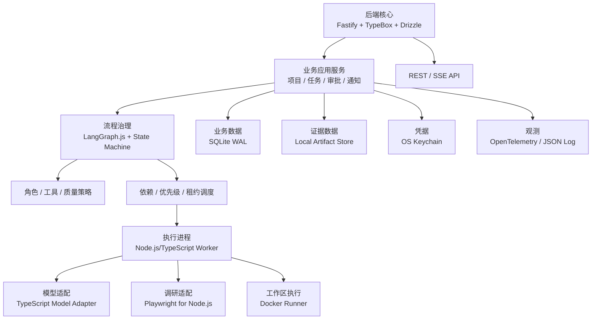

后端关键适配关系：

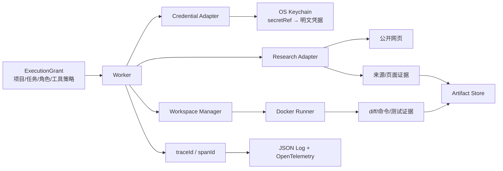

### 2.4 后端核心技术边界

```text
Node.js + TypeScript + Fastify + TypeBox + Drizzle
    ├── 负责：HTTP 接口、请求校验、应用服务、事务边界和 SSE
    ├── 不负责：直接执行模型、网页、任意命令或测试
    └── 调用：LangGraph.js、业务仓储、Worker 接入和查询投影

LangGraph.js + 显式状态机
    ├── 负责：流程节点、条件边、人工关卡、状态转换和恢复点
    ├── 不负责：直接写数据库、直接调用 Docker 或替 Boss 审批
    └── 输出：允许/拒绝、下一任务、阻塞原因、人工关卡和恢复动作

Node.js/TypeScript Worker
    ├── 负责：领取 ExecutionGrant、运行员工、心跳、取消和回传
    ├── 不负责：直接修改业务状态、直接写 SQLite 或关闭缺陷
    └── 依赖：TypeScript Model Adapter、Research Adapter、Workspace Manager、Docker Runner、Credential Adapter

TypeScript Model Adapter / Research Adapter / Workspace Manager
    ├── TypeScript Model Adapter：模型请求、供应商错误、Token、成本、超时和重试
    ├── Research Adapter：把网页访问封装为“搜索/打开/提取/引用”能力
    ├── Workspace Manager：创建任务工作区、发放路径权限、收集变更和清理生命周期
    └── 三者输出都必须经过脱敏、证据哈希和结果 Schema 校验

Playwright for Node.js / Chromium
    ├── 负责：在受控浏览器上下文中访问公开网页、读取页面和记录来源元数据
    ├── 不负责：决定业务结论、修改流程、获得本地文件权限或执行任意命令
    └── 网页内容按不可信输入处理；页面文本只能作为待验证的调研材料

Research Adapter
    ├── 输入：ResearchGrant（项目、任务、允许域名/URL、超时、页数、证据策略）
    ├── 输出：来源 URL、标题、访问时间、摘要、引用片段、页面快照/哈希和失败原因
    ├── 保护：去除脚本指令和敏感信息；禁止网页内容改变角色、流程或工具权限
    └── 不负责：替 PM 做最终判断；结论必须回到业务任务和交付物链路

Workspace Manager / Docker Runner
    ├── Workspace Manager：按 projectId/attemptId 创建隔离目录，生成 WorkspaceGrant
    ├── Docker Runner：在非 root 容器中执行允许的文件、命令、构建和测试
    ├── 保护：路径规范化、允许命令清单、资源/超时限制、网络策略和并行写入隔离
    └── 输出：变更 diff、命令记录、退出码、测试结果、日志和证据引用；不直接推进业务状态

Credential Adapter / OS Keychain
    ├── SQLite：保存 provider、model、secretRef、配置版本和连接状态，不保存 API Key 明文
    ├── Keychain：保存 API Key 明文；仅在实际外部调用边界按 secretRef 读取
    ├── 禁止：凭据进入 UI、数字员工上下文、日志、事件、交付物、备份包和错误消息
    └── 迁移：目标环境重新录入/绑定并通过连接测试，未绑定时禁止真实模型调用

OpenTelemetry JS / JSON Log
    ├── 关联字段：traceId、spanId、projectId、taskId、attemptId、actor、eventType
    ├── 记录：开始/结束时间、耗时、状态、错误、重试、Token/成本、退出码和证据引用
    ├── 用途：调用控制台、故障定位、恢复分析、评估记分卡和审计追踪
    └── 保护：只保存脱敏摘要；不替代业务事件，不保存凭据明文，不把日志当作唯一业务事实源

SQLite WAL / Artifact Store / Keychain
    ├── SQLite：当前业务状态、事件、版本、Outbox 和检查点
    ├── Artifact Store：大文本、文件差异、测试输出和附件
    ├── Keychain：凭据明文；SQLite 只保存 secretRef
    └── 数据平台不自行推进流程，只由业务应用服务写入和读取
```

### 2.5 桌面壳层与本地进程边界

V1 采用 Electron + React/Vite + Node.js/TypeScript sidecar 的桌面应用架构。Electron 负责桌面窗口、应用生命周期、受控 IPC、sidecar 管理和安装包；React/Vite 运行在 Electron Renderer 中，负责产品界面；Node.js/TypeScript + Fastify 是业务控制面，负责 readiness、持久化、业务 API、流程编排和后续 Agent/Worker 接入。Docker Engine/Desktop 是隔离代码、构建和测试的本地执行依赖，不是前后端的强制包装方式。

| 组件 | 进程/运行位置 | 责任 | 禁止事项 |
| --- | --- | --- | --- |
| Electron Main | 本机桌面主进程 | 创建窗口、生成一次性 sidecar token、选择本机端口、启动/停止/监控 Node.js sidecar、处理升级和诊断 | 不承载业务状态，不直接绕过业务 API 修改 SQLite |
| Electron Preload | 每个 Renderer 的受控桥 | 只暴露白名单 IPC，如 readiness、线程、项目、文件选择和事件订阅 | 不暴露 `require`、Node、任意 `fs`、`child_process` 或通用 `execute` |
| React/Vite Renderer | Electron Chromium Renderer | 展示看板、线程、任务、Diff、终端、审批、办公室和调用控制台 | 不直接访问文件系统、Keychain、Docker、模型或数据库 |
| Node.js/TypeScript sidecar | Electron 子进程 | 提供 `/api/v1` 控制面、SQLite/Artifact/Trace、StartupGate、业务服务和 Worker 接入 | 不接受无 token 的外部本机请求，不由模型输出直接推进状态 |
| Docker Engine/Desktop | 本机 Docker runtime | 执行经过授权的隔离代码/构建/测试尝试 | 不承载 Electron UI；readiness 探针不等同真实业务执行 |

桌面进程关系：

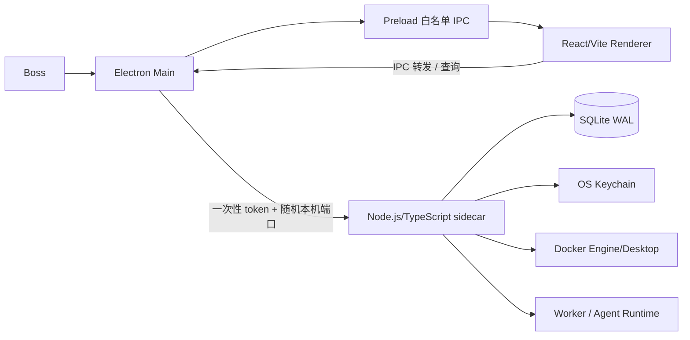

启动顺序固定为：Electron 主进程生成启动上下文 → 启动 sidecar → sidecar 初始化持久化根目录并执行 Schema/readiness 检查 → sidecar 返回健康状态 → Electron 加载 Renderer → Renderer 订阅 readiness 和事件。任一步骤失败，桌面窗口仍可显示诊断信息，但不得把失败状态误报为可执行。

sidecar 访问边界固定为：只绑定 `127.0.0.1` 的随机可用端口；Electron 为每次启动生成一次性随机 token，通过受控启动环境传入；所有 API 请求必须携带 token；sidecar 关闭或 token 失效后请求返回 `403 POLICY_DENIED`。这层 token 只用于桌面进程边界，业务高风险操作仍必须经过业务授权、状态机、二次确认和审计。

## 3. 总体架构

### 3.1 系统上下文图

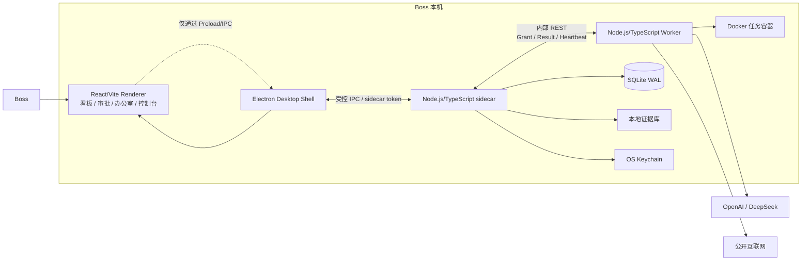

### 3.2 运行部署图

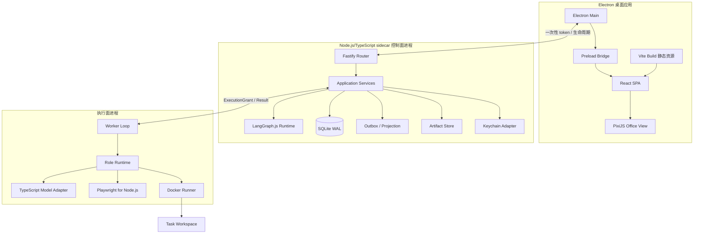

### 3.3 一级模块关系图

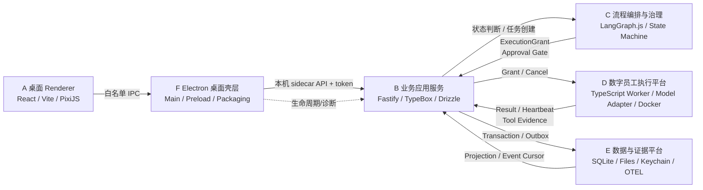

模块之间不是六个独立微服务，而是一个本地产品中的六个逻辑边界：F 负责桌面壳层与进程生命周期；B 是业务协调中心；C 决定流程；D 执行真实操作；E 保存事实；A 负责展示和交互。

### 3.4 一级模块调用规则

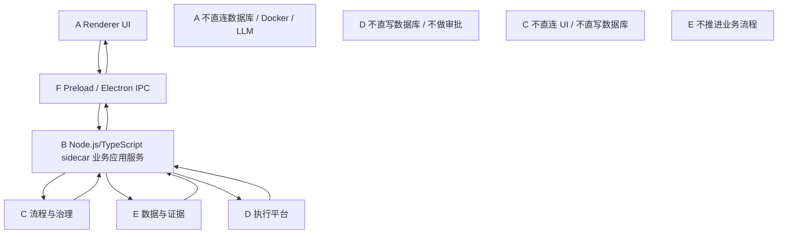

## 4. 一级模块与二级模块设计

### 4.1 A：桌面 Renderer 与前端 UI

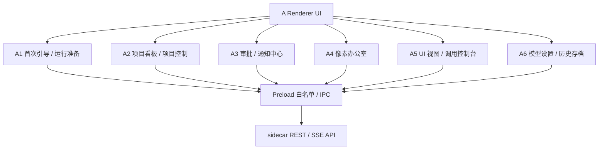

技术：React + TypeScript + Vite；在 Electron Renderer 中运行；状态查询使用 TanStack Query；本地页面状态使用 Zustand；像素办公室使用 PixiJS。A 不承载业务决策，也不直接访问 Node、文件系统、Keychain、Docker 或 sidecar socket。

Renderer 只能调用 Preload 暴露的白名单能力，业务命令仍由 Node.js/TypeScript sidecar 的 API、状态机和审计链决定。浏览器开发模式可以通过 Vite 代理访问本机控制面，但这只是开发/诊断入口，不改变桌面应用的正式交付边界。

### 4.2 B：业务应用服务

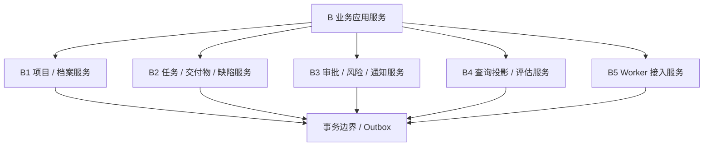

技术：Node.js + TypeScript + Fastify + TypeBox + Drizzle ORM。B 负责命令受理、聚合更新、事务提交、事件写入、SSE 推送和 Worker 接入。

### 4.3 C：流程编排与治理

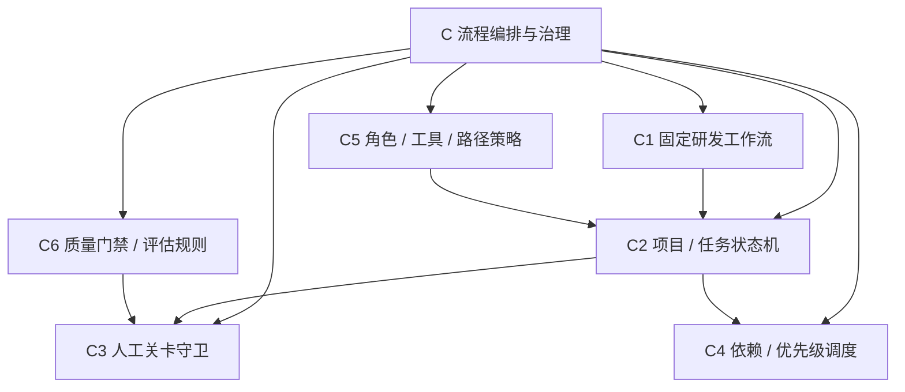

技术：LangGraph.js 保存固定流程图与检查点；显式状态机负责合法状态转换；策略模块负责角色和工具授权；质量门禁使用确定性规则。

### 4.4 D：数字员工执行平台

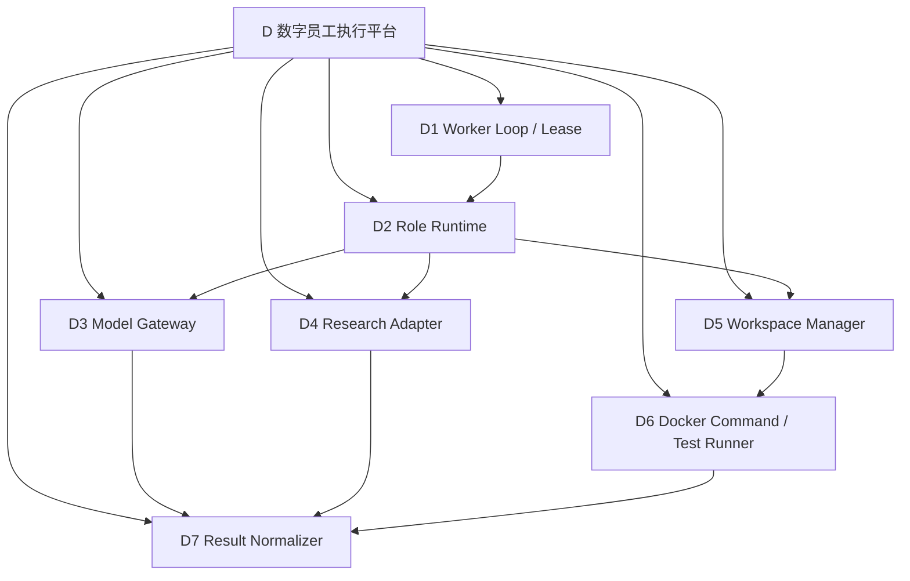

技术：独立 Node.js/TypeScript Worker；TypeScript Model Adapter；Playwright for Node.js；Docker；每个任务一个 `ExecutionAttempt`、一个 `ExecutionGrant` 和一个隔离可写工作区。

#### 4.4.1 D8：编码 Agent 核心运行时

编码 Agent 是 D 数字员工执行平台中的核心运行时，不等同于“模型 + bash”。它将开发任务转换为可恢复的工程闭环：读取上下文、生成计划、分批修改、真实验证、根据失败反馈修复、生成交接包并等待 Review。模型负责提出下一步动作，策略层决定动作是否合法，执行器负责产生真实结果，业务服务负责推进流程。V1 采用自研控制核心和 `AgentHarness SPI`，仅实现 `NativeCodingHarness`；LangGraph（如用于外层研发工作流）不作为编码 Agent 的流程中心，也不改变单会话单 Agent 的设计边界。

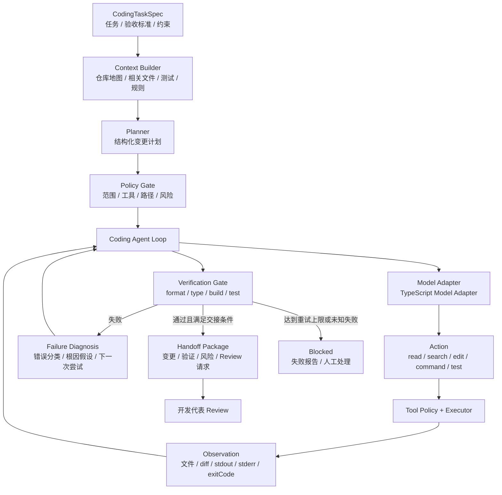

#### 4.4.2 编码 Agent 分层

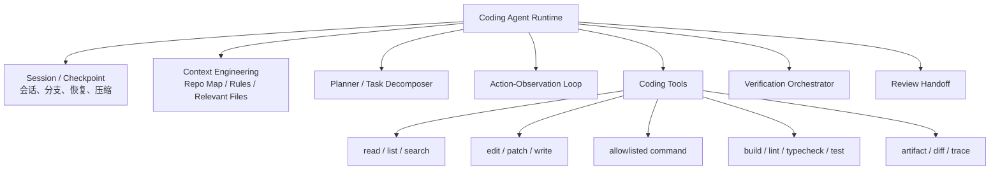

| 层级 | 责任 | 禁止事项 |
| --- | --- | --- |
| Session / Checkpoint | 保存会话、执行尝试、上下文摘要、当前计划、已完成步骤和恢复点 | 不覆盖历史尝试，不丢失当前 diff |
| Context Engineering | 建立仓库地图，选择相关文件、规则、测试、接口和历史失败上下文 | 不把整个仓库无差别塞进上下文 |
| Planner | 输出结构化目标、文件范围、方案、验证命令和风险 | 不直接绕过策略写文件 |
| Action-Observation Loop | 让模型提出动作并接收真实工具观察，循环至完成、阻塞或取消 | 不把模型自述当作执行结果 |
| Coding Tools | 提供读取、搜索、编辑、命令、测试和证据写入 | 不暴露未授权路径和任意命令 |
| Verification Orchestrator | 按顺序执行格式、类型、构建、单测、集成测试等验证 | 不因模型声称成功而跳过验证 |
| Review Handoff | 生成 diff、测试、风险和未解决项并请求开发代表 Review | 不自行批准 Review 或关闭缺陷 |

#### 4.4.3 编码 Agent 状态机

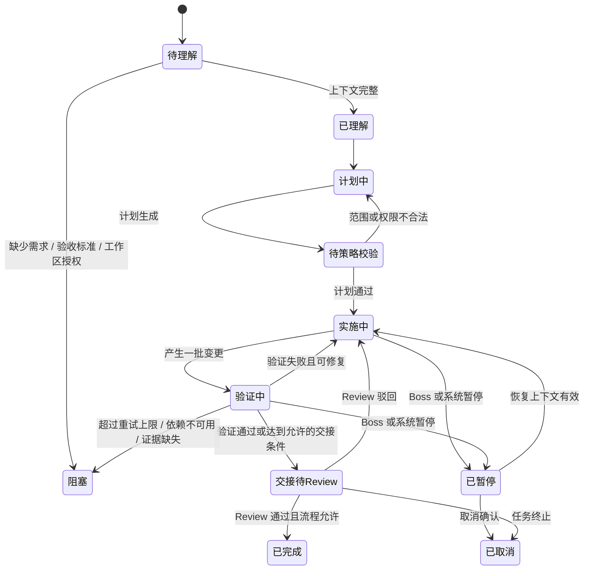

#### 4.4.4 上下文工程与压缩

编码 Agent 每次循环向模型提供的上下文不采用“整个仓库全文”策略，而采用分层上下文：

```text
固定层：岗位规则、工具策略、安全边界、输出 Schema
任务层：任务目标、验收标准、依赖、截止时间、已批准方向
仓库层：目录树、项目技术栈、入口、构建/测试命令、项目规则文件
相关层：与当前任务相关的文件、符号、调用方、测试和接口
执行层：最近动作、工具观察、当前 diff、失败摘要、下一步计划
```

上下文接近模型窗口上限时，生成结构化压缩摘要，至少保留：

```text
任务目标 / 已批准约束 / 已完成步骤 / 已读取文件 / 已修改文件
当前 diff 摘要 / 已执行命令 / 失败与根因假设 / 测试结果
未解决问题 / 剩余风险 / 下一步动作 / artifactRef / traceId
```

压缩后必须能够从 checkpoint 恢复，不得重复已完成的破坏性命令或丢失未提交变更。

#### 4.4.5 工具策略与执行授权

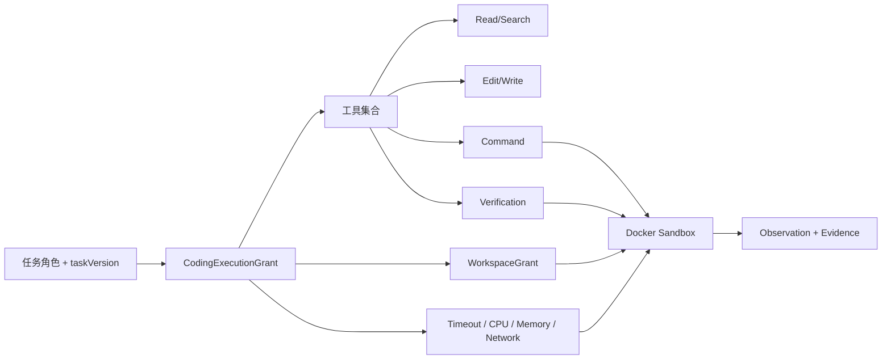

`CodingExecutionGrant` 至少包含：`projectId`、`taskId`、`attemptId`、`roleVersion`、`taskVersion`、`workspaceGrant`、`toolPolicy`、`commandPolicy`、`deadline`、`leaseExpiresAt` 和 `traceId`。工具调用先经过策略校验，再进入 Docker；策略拒绝必须记录原因，但不能把完整凭据或隐藏提示词写入日志。

#### 4.4.6 验证与质量门禁

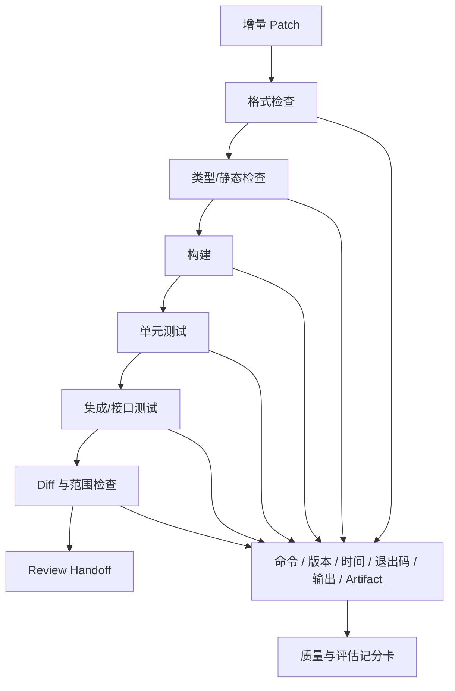

验证顺序由项目技术栈和任务策略决定，但必须遵循：

1. 快速、低成本检查先执行；
2. 失败时保留完整输出并分类；
3. 可修复失败进入下一次尝试；
4. 重复失败达到上限后阻塞并升级；
5. 验证通过不等于 Review 通过；
6. Review 通过不等于测试放行；
7. 所有“通过”都必须有真实证据。

#### 4.4.7 编码 Agent 结果接口

```json
{
  "attemptId": "attempt_01J...",
  "status": "review_requested",
  "plan": {"goal": "...", "files": [], "checks": [], "risks": []},
  "changedFiles": [],
  "diffArtifactRef": "artifact_diff_01J...",
  "verification": [{"name": "vitest", "exitCode": 0, "artifactRef": "artifact_test_01J..."}],
  "failures": [],
  "remainingRisks": [],
  "nextAction": "developer_representative_review",
  "traceId": "trace_01J..."
}
```

编码 Agent 只能返回执行结果和交接请求；`Application Service` / `Workflow Governance` 才能根据结果更新任务、创建缺陷、路由 NPI 或进入人工 Review。

### 4.5 E：数据与证据平台

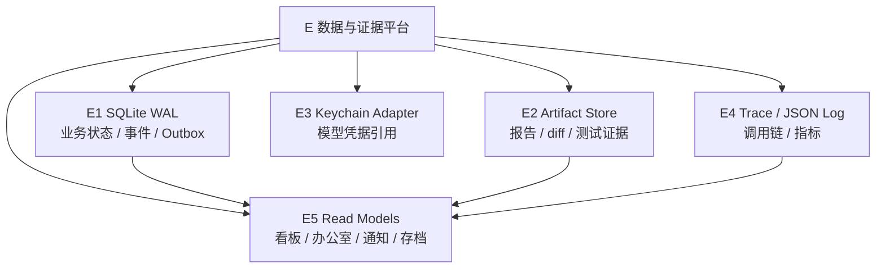

## 5. 模块间调用设计

### 5.1 Boss 启动项目

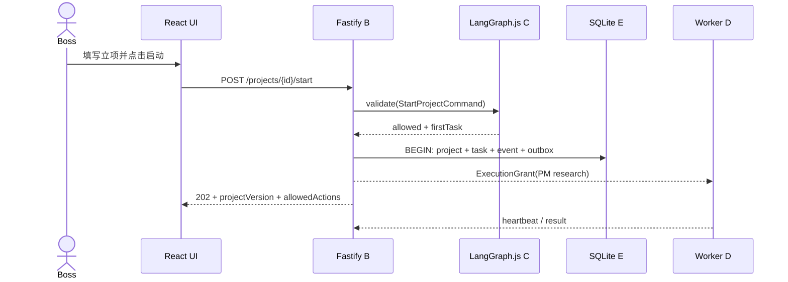

### 5.2 一次执行任务

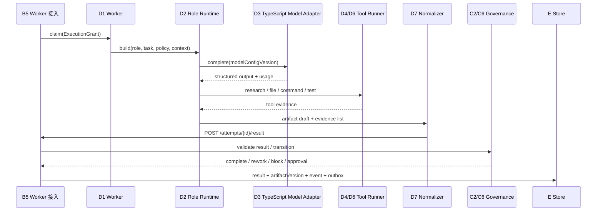

### 5.3 审批与方向意见

```mermaid
sequenceDiagram
    participant UI as A3 Approval UI
    participant B3 as B3 Approval Service
    participant C3 as C3 Gate Guard
    participant B2 as B2 Task Service
    participant E as E Store
    participant C1 as C1 Workflow

    UI->>B3: POST /approvals/{id}/decision
    B3->>C3: verify boss / evidenceVersion / opinion
    C3-->>B3: allow
    B3->>E: decision + opinion + event + outbox
    B3->>C1: advance(decision)
    C1->>B2: create next task or rework task
    B2->>E: task + traceLink + event
```

### 5.4 测试失败与 NPI 回归

```mermaid
sequenceDiagram
    participant TEST as D6 Test Runner
    participant B2 as B2 Task Service
    participant C as C2/C6 Governance
    participant NPI as D2 NPI Runtime
    participant UI as A2/A3 UI

    TEST->>B2: TestRun(failed, evidence)
    B2->>C: validate(reviewedBaseline, evidence)
    C-->>B2: create Defect + NPI tasks
    B2-->>NPI: ExecutionGrant(analyze/fix)
    NPI->>B2: fix artifact + regression request
    B2-->>TEST: ExecutionGrant(regression)
    TEST->>B2: RegressionResult
    B2->>C: close defect only if tester evidence passed
    C-->>UI: event + notification + next action
```

### 5.5 应用重启恢复

```mermaid
sequenceDiagram
    participant BOOT as Control Plane Boot
    participant E as SQLite / Outbox / Checkpoint
    participant W as Worker
    participant C as State Machine
    participant UI as React UI

    BOOT->>E: load active project and last checkpoint
    BOOT->>W: inspect lease / heartbeat
    W-->>BOOT: completed / unknown / safe-to-retry
    BOOT->>C: recover(checkpoint, leaseResult)
    C-->>BOOT: legal state + pending tasks
    BOOT->>E: append recovery event / rebuild read models
    BOOT-->>UI: SSE snapshot within 60s
```

## 6. 工作流与状态设计

### 6.1 研发主流程

```mermaid
flowchart LR
    S0["准备 / 立项"] --> S1["调研 / PRD"]
    S1 --> S2["PM 交叉评审"] --> G1{"Boss PRD 审批"}
    G1 -->|驳回| S1
    G1 -->|通过| S3["可行性讨论"]
    S3 --> G2{"需求争议"}
    G2 -->|需要裁决| G3{"Boss 争议裁决"}
    G3 -->|重新评估| S1
    G3 -->|继续| S4["任务拆解"]
    G2 -->|无争议| S4
    S4 --> S5["开发 / 自测"] --> G4{"开发代表 Review"}
    G4 -->|驳回| S5
    G4 -->|通过| S6["测试策略 / 用例"] --> S7["真实测试"]
    S7 --> G5{"测试通过"}
    G5 -->|失败| S8["缺陷 / NPI / 回归"] --> G5
    G5 -->|通过| G6{"Boss 测试放行"}
    G6 -->|驳回| R6["责任组长制定处理计划"] --> S6
    G6 -->|通过| S9["结项门禁 / 存档"]
```

### 6.2 项目状态图

```mermaid
stateDiagram-v2
    state "等待 Boss" as WAIT_BOSS
    [*] --> 准备中
    准备中 --> 运行中: Boss 启动
    准备中 --> 已终止: 终止确认
    运行中 --> WAIT_BOSS: 到达人工关卡
    运行中 --> 已暂停: Boss 暂停
    运行中 --> 已阻塞: 系统异常 / 重大风险
    运行中 --> 结项中: 放行通过
    运行中 --> 已终止: 终止确认
    WAIT_BOSS --> 运行中: 审批完成
    WAIT_BOSS --> 已暂停: Boss 暂停
    WAIT_BOSS --> 已终止: 终止确认
    已暂停 --> 运行中: Boss 恢复
    已暂停 --> 已终止: 终止确认
    已阻塞 --> 运行中: 阻塞解除
    已阻塞 --> 已暂停: Boss 暂停
    已阻塞 --> 已终止: 终止确认
    结项中 --> 已结项: 门禁通过
    结项中 --> 已阻塞: 检查失败
    结项中 --> 已终止: 终止确认
```

### 6.3 任务状态图

```mermaid
stateDiagram-v2
    state "等待 Review" as WAIT_REVIEW
    [*] --> 待处理
    待处理 --> 进行中: 依赖满足 / 获得租约
    待处理 --> 阻塞: 依赖或服务不可用
    进行中 --> WAIT_REVIEW: 提交代码交付物
    进行中 --> 等待审批: 需要人工关卡
    进行中 --> 已完成: 无 Review 门禁且证据完整
    进行中 --> 阻塞: 执行失败 / 外部依赖失败
    进行中 --> 已终止: 项目终止
    WAIT_REVIEW --> 返工: Review 驳回
    WAIT_REVIEW --> 已完成: Review 通过
    WAIT_REVIEW --> 阻塞: Reviewer / 依赖阻塞
    WAIT_REVIEW --> 已终止: 项目终止
    等待审批 --> 返工: Boss 驳回
    等待审批 --> 已完成: Boss 通过
    等待审批 --> 阻塞: 审批依赖异常
    等待审批 --> 已终止: 项目终止
    阻塞 --> 进行中: 新尝试
    阻塞 --> 已终止: 项目终止
    返工 --> 进行中: 责任人领取
    返工 --> 阻塞: 返工条件受阻
    返工 --> 已终止: 项目终止
```

## 7. 数据与接口概要设计

### 7.1 核心数据关系图

```mermaid
erDiagram
    PROJECT ||--o{ TASK : contains
    PROJECT ||--o{ APPROVAL : gates
    PROJECT ||--o{ DOMAIN_EVENT : records
    TASK ||--o{ EXECUTION_ATTEMPT : runs
    TASK }o--o{ TASK : depends
    TASK ||--o{ ARTIFACT_VERSION : produces
    ARTIFACT ||--|{ ARTIFACT_VERSION : versions
    ARTIFACT_VERSION ||--o{ REVIEW : reviewed
    TASK ||--o{ TEST_CASE : verifies
    TEST_CASE ||--o{ TEST_RUN : executes
    TEST_RUN ||--o{ DEFECT : finds
    DEFECT ||--o{ ARTIFACT_VERSION : fixed_by
    EXECUTION_ATTEMPT ||--o{ MODEL_CALL : contains
    EXECUTION_ATTEMPT ||--o{ TOOL_CALL : contains
    DOMAIN_EVENT ||--o{ NOTIFICATION : generates
    ARTIFACT_VERSION ||--o{ TRACE_LINK : links
```

### 7.2 外部 API 声明

| 方法 | 路径 | 说明 | 返回 |
| --- | --- | --- | --- |
| `GET` | `/api/v1/readiness` | 查询模型、Docker、网页和工作区准备状态 | `ReadinessView` |
| `POST` | `/api/v1/projects` | 创建立项 | `ProjectView` |
| `POST` | `/api/v1/projects/{id}/start` | 启动数字公司 | `CommandResult` |
| `POST` | `/api/v1/projects/{id}/pause` | Boss 主动暂停 | `CommandResult` |
| `POST` | `/api/v1/projects/{id}/resume` | Boss 恢复 | `CommandResult` |
| `POST` | `/api/v1/projects/{id}/terminate/preview` | 终止影响预览 | `TerminatePreview` |
| `POST` | `/api/v1/projects/{id}/terminate/confirm` | 二次确认终止 | `CommandResult` |
| `GET` | `/api/v1/projects/{id}/dashboard` | 看板查询 | `DashboardView` |
| `GET` | `/api/v1/approvals/{id}` | 审批证据查询 | `ApprovalView` |
| `POST` | `/api/v1/approvals/{id}/decision` | Boss 通过/驳回 | `CommandResult` |
| `GET` | `/api/v1/notifications` | 通知查询 | `NotificationPage` |
| `GET` | `/api/v1/projects/{id}/office` | 像素办公室投影 | `OfficeView` |
| `GET` | `/api/v1/executions` | 调用控制台查询 | `ExecutionPage` |
| `GET` | `/api/v1/events?after={eventId}` | SSE 状态事件流 | `text/event-stream` |

### 7.3 写命令声明

```json
{
  "commandId": "cmd_01J...",
  "idempotencyKey": "ui-start-01J...",
  "aggregateId": "project_01J...",
  "expectedVersion": 12,
  "actor": {"type": "boss", "id": "boss-local"},
  "payload": {}
}
```

统一响应：`CommandResult { aggregateId, version, eventId, allowedActions, traceId }`。统一错误：`400 INVALID_ARGUMENT`、`403 POLICY_DENIED`、`409 VERSION_CONFLICT`、`409 WORKFLOW_GUARD_BLOCKED`、`422 EVIDENCE_INCOMPLETE`、`503 EXTERNAL_DEPENDENCY_UNAVAILABLE`。

### 7.4 Worker 内部接口声明

```text
POST /internal/v1/grants/claim
POST /internal/v1/attempts/{attemptId}/heartbeat
POST /internal/v1/attempts/{attemptId}/tool-records
POST /internal/v1/attempts/{attemptId}/result
POST /internal/v1/attempts/{attemptId}/cancelled
```

`ExecutionGrant`：`attemptId`、`taskId`、`taskVersion`、`roleVersion`、`modelConfigVersion`、`workspaceGrant`、`toolPolicy`、`deadline`、`leaseExpiresAt`、`traceId`。

`ExecutionResult`：`attemptId`、`taskVersion`、`status`、`artifacts[]`、`toolCalls[]`、`evidenceRefs[]`、`error`、`retryable`、`traceId`。

## 8. 数据存储、迁移与保管设计

### 8.1 数据分类与存储边界

```mermaid
flowchart TB
    APP["应用服务 / Worker"] --> DB[("业务数据库\ncompany.db + WAL")]
    APP --> ART["证据文件库\nartifacts/"]
    APP --> TRACE["调用与追踪\ntraces/"]
    APP --> WS["项目工作区\nworkspaces/"]
    APP --> KC["OS Keychain\n凭据明文"]
    DB --> BUNDLE["运维备份包\nDB 快照 + 文件 + manifest"]
    ART --> BUNDLE
    TRACE --> BUNDLE
    WS --> BUNDLE
    KC -. "不进入备份包；目标环境重新绑定" .-> REBIND["目标环境凭据重绑定"]
```

| 数据类别 | V1 存储位置 | 是否进入业务备份包 | 删除/保管边界 |
| --- | --- | --- | --- |
| 当前业务状态、项目、任务、审批、事件、Outbox、检查点 | `data/company.db`、`company.db-wal`、`company.db-shm` | 是；按一致性快照处理 | 受项目生命周期和历史删除规则控制 |
| 交付物与执行证据 | `data/artifacts/` | 是；按文件哈希校验 | 与业务对象关联删除，不允许孤立残留 |
| 调用、工具、测试和追踪明细 | `data/traces/` | 是；与事件链路关联 | 按审计/保管策略保留，摘要不得含密钥 |
| 并行任务工作区 | `data/workspaces/<project>/<attempt>/` | 是；仅保留恢复所需内容 | 任务完成后按工作区清理策略处理 |
| 模型/API 凭据 | OS Keychain；数据库只保存 `secretRef` | 否 | 迁移到新环境后由运维重新录入或重新绑定 |

### 8.2 文件布局与持久化根目录

```text
<persistent-root>/
├── company.db                 # SQLite 主库
├── company.db-wal             # WAL 模式运行时文件
├── company.db-shm             # WAL 共享内存文件
├── artifacts/                 # 交付物、来源、diff、测试附件
├── traces/                    # 调用、工具、命令、测试和追踪明细
├── workspaces/                # 项目/尝试级隔离工作区
├── backups/                   # 运维生成的备份包与校验清单
└── manifest.json              # 数据版本、应用版本、Schema revision、文件哈希
```

代码目录、安装目录和临时容器层不得作为业务数据目录。桌面部署由应用配置决定持久化根目录；容器部署必须把宿主机持久卷挂载到该目录，例如 `/var/lib/digital-harness` → `/app/data`。

### 8.3 部署与持久化卷关系

```mermaid
flowchart LR
    subgraph DESKTOP["桌面部署"]
        APP1["应用进程"] --> ROOT1["OS 应用数据目录\nPersistent Root"]
    end
    subgraph SERVER["服务器/容器部署"]
        APP2["Node.js/TypeScript sidecar + Worker 容器"] --> MOUNT["/app/data"]
        MOUNT --> VOL["宿主机持久卷\n/var/lib/digital-harness"]
    end
    ROOT1 --> BACKUP["运维备份任务"]
    VOL --> BACKUP
    BACKUP --> TARGET["批准的目标环境持久卷"]
```

### 8.4 备份、恢复与环境迁移时序

```mermaid
sequenceDiagram
    participant O as 运维人员
    participant A as 应用服务
    participant DB as SQLite
    participant FS as artifacts/traces/workspaces
    participant T as 目标环境
    O->>A: 请求进入备份窗口
    A->>A: 停止接收新命令，Worker 完成/安全暂停
    A->>DB: WAL checkpoint / 一致性快照
    DB-->>O: company.db 快照
    O->>FS: 复制文件并计算 SHA-256
    O->>O: 生成 manifest（应用版本/Schema/文件哈希）
    O->>T: 写入目标 persistent-root
    T->>T: 执行 Drizzle schema migration
    T->>T: 校验 manifest、对象关联和事件链
    O->>T: 重新绑定 OS Keychain 凭据并执行连接测试
    T-->>O: 恢复检查结果
    O->>T: 启动应用，保持只读检查窗口
```

### 8.5 迁移层次与边界

| 层次 | 处理内容 | 方式 | 产品入口 |
| --- | --- | --- | --- |
| Schema 迁移 | 表结构、索引、约束和版本 | Drizzle migration；启动前检查 migration journal | 无 |
| 业务数据迁移 | `company.db`、证据、追踪和工作区 | 运维备份包 + manifest + 哈希校验 | 无 |
| 凭据迁移 | API Key 等敏感凭据 | 新环境重新录入/绑定 OS Keychain | 设置页仅提供本机配置 |
| 用户功能 | 项目 ZIP 导出、用户导入、跨设备迁移 | V1 明确不提供 | 不得新增按钮或 API |

### 8.6 保管、删除与升级策略

```mermaid
flowchart TB
    ACTIVE["活动项目"] --> HISTORY["结项/终止历史存档"]
    HISTORY --> READONLY["只读复盘"]
    READONLY --> DELETE["Boss 二次确认删除"]
    DELETE --> AUDIT["保留最小删除审计\nprojectId / deletedAt / actor"]
    ACTIVE -. "备份失败/校验失败" .-> BLOCK["阻断切换并告警"]
    BACKUP["备份包"] --> VERIFY["恢复前 manifest + 哈希校验"]
    VERIFY --> RESTORE["恢复到持久化根目录"]
```

备份包属于企业内部运维资产，必须与代码版本、Schema revision 和凭据绑定信息一并登记；任何校验失败都不得启动可写业务。历史删除首先作用于在线持久化根目录和产品查询面；已有备份快照按企业备份保留周期管理，到期后随备份包一并销毁，不通过修改历史备份来规避审计。SQLite 适用于 V1 的单机、单 Boss、单活动项目边界；若未来需要多用户、多实例或云部署，应将业务数据库替换为 PostgreSQL、证据迁移至对象存储，并引入集中式密钥与任务队列，接口层保持不变。

## 9. 安全、可靠性与可观测性设计图

### 9.1 V1 安全边界与威胁面

V1 安全目标是保护本机企业数据、模型凭据、网页输入、任务工作区和流程权限；不建设公网 SaaS 的完整企业安全体系。安全控制按“本机访问、业务策略、执行隔离、数据保护、审计观测”五层布置。

```mermaid
flowchart LR
    UI["React UI"] --> AUTH["Origin / Session / CSRF"]
    AUTH --> API["Fastify Policy Hooks"]
    API --> RBAC["Role / Object / Tool Policy"]
    RBAC --> WF["Workflow Guard"]
    RBAC --> GRANT["ExecutionGrant"]
    GRANT --> WORKER["Worker"]
    WORKER --> PATH["Path Canonicalizer"]
    WORKER --> CMD["Command Allowlist"]
    PATH & CMD --> DOCKER["Non-root Docker Container"]
    WORKER --> REDACT["Redaction"]
    REDACT --> LOG["Event / Trace / UI Summary"]
    KEY["OS Keychain"] -. secretRef only .-> API
```

| 威胁面 | V1 控制点 | 失败处理 |
| --- | --- | --- |
| 本机 API 被越权调用 | 默认监听 `127.0.0.1`、Origin/Session/CSRF、业务策略 | 拒绝请求并记录安全事件 |
| Boss 高风险操作误触发 | 状态机校验、二次确认、审计事件 | 不改变业务状态 |
| 网页/模型提示注入 | Research Adapter 不可信输入隔离、工具策略 | 丢弃越权指令并阻断调用 |
| 文件路径越界 | WorkspaceGrant、路径规范化、项目边界 | 拒绝文件操作并审计 |
| 任意命令执行 | Command Allowlist、Docker、资源和超时限制 | 拒绝启动或终止容器 |
| API Key 泄露 | OS Keychain、`secretRef`、脱敏 | 阻止调用并告警 |
| 证据/日志敏感信息泄露 | Redaction、最小摘要、权限控制 | 不写入或掩码后再写入 |

### 9.2 访问与本机通信安全

```text
Node.js / Fastify Runtime
    ├── 默认监听：127.0.0.1；不得默认暴露 0.0.0.0
    ├── 请求边界：Origin / Session / CSRF 校验和 TypeBox Schema 校验
    ├── 高风险命令：启动、暂停、恢复、终止、删除、审批必须经过状态机和策略校验
    ├── 破坏性操作：终止和历史删除需要二次确认并记录操作者、对象、原因和结果
    └── V1 非目标：公网访问、多人身份、企业 SSO、多租户和复杂 RBAC
```

### 9.3 凭据与敏感信息保护

禁止凭据明文进入 UI、数字员工上下文、日志、事件、通知、交付物、错误消息和备份包。目标环境迁移后必须重新录入或绑定凭据，连接测试通过前不得启动真实模型调用。

```mermaid
sequenceDiagram
    participant UI as React UI
    participant API as Fastify
    participant DB as SQLite
    participant KC as OS Keychain
    participant LLM as OpenAI / DeepSeek
    UI->>API: 保存 provider / model / API Key
    API->>KC: 保存凭据明文
    KC-->>API: 返回 secretRef
    API->>DB: 保存配置和 secretRef
    API-->>UI: 返回脱敏状态
    API->>KC: 按调用读取 secretRef
    KC-->>API: 返回短时调用凭据
    API->>LLM: 发起模型调用
```

### 9.4 网页输入、工具和执行隔离

```mermaid
flowchart LR
    INPUT["网页 / 模型 / 文件 / 命令输出"] --> UNTRUST["不可信输入层"]
    UNTRUST --> SCHEMA["Schema / 内容 / 大小校验"]
    SCHEMA --> POLICY["Role / Object / Tool Policy"]
    POLICY --> GRANT["ExecutionGrant / WorkspaceGrant"]
    GRANT --> RUN["Research Adapter 或 Docker Runner"]
    RUN --> RESULT["脱敏结果 + 证据哈希 + traceId"]
    RESULT --> APP["业务应用服务"]
```

执行授权必须绑定项目、任务、角色、工具、工作区、版本、有效期和 `traceId`。Worker 不得使用过期、跨项目或超出策略的授权；执行器不直接推进业务状态。

### 9.5 数据、备份与删除安全

- 业务数据库、证据文件、工作区和追踪数据必须位于持久化根目录，代码目录和临时容器层不得保存业务数据。
- 备份包包含数据库一致性快照、关联文件、manifest 和哈希校验，但不包含凭据明文。
- 历史删除作用于在线数据和产品查询面；备份快照按保留周期到期销毁，不通过修改历史备份规避审计。
- 数据目录、备份目录和日志目录使用最小文件系统权限；具体权限值在详细设计和部署清单中冻结。

### 9.6 审计、可观测性和安全事件

```mermaid
flowchart LR
    ACTION["调用 / 审批 / 拒绝 / 越界 / 脱敏 / 失败"] --> CONTEXT["traceId + projectId + taskId + attemptId + actor"]
    CONTEXT --> EVENT["DomainEvent / Audit"]
    CONTEXT --> LOG["JSON Log"]
    CONTEXT --> TRACE["OpenTelemetry Span"]
    EVENT --> UI["通知 / 历史 / 审计视图"]
    LOG & TRACE --> CONSOLE["调用控制台 / 评估记分卡"]
```

安全事件至少记录事件类型、对象、操作者、执行尝试、结果、拒绝原因、脱敏原因和链路标识。日志用于定位和观测，但不替代业务事件，也不作为唯一业务事实源。

### 9.7 V1 安全非目标

```text
V1 不提供：公网访问防护、多人身份与企业 SSO、多租户、集中式 Secrets Manager、WAF、DDoS 防护、HSM、跨地域灾备和高可用安全集群。
V1 必须提供：本机访问边界、凭据隔离、网页不可信输入隔离、工作区/命令/容器隔离、敏感信息脱敏、关键操作审计和安全失败阻断。
```

### 9.8 可靠性与恢复图

```mermaid
flowchart TB
    CMD["Command"] --> TX["SQLite Transaction"]
    TX --> STATE["Current State"]
    TX --> EVENT["Append-only DomainEvent"]
    TX --> OUTBOX["Outbox"]
    OUTBOX --> SSE["SSE / Notification / Projection"]
    TX --> CP["Checkpoint"]
    CRASH["Process / Worker Crash"] --> LEASE["Lease Expiry"]
    LEASE --> RECOVER["Recovery Coordinator"]
    CP --> RECOVER
    EVENT --> RECOVER
    RECOVER --> GUARD["State Machine Re-check"]
    GUARD --> NEXT["Resume / Block / Safe Retry"]
```

### 9.9 可观测性关联图

```mermaid
flowchart LR
    API["REST Command"] --> TRACE["traceId"]
    TRACE --> WF["Workflow Span"]
    TRACE --> MODEL["ModelCall"]
    TRACE --> WEB["ResearchCall"]
    TRACE --> FILE["File / Command Call"]
    TRACE --> TEST["TestRun"]
    TRACE --> EVENT["DomainEvent"]
    MODEL & WEB & FILE & TEST & EVENT --> VIEW["调用控制台 / 记分卡 / 审计"]
```

## 10. 测试设计概要

```mermaid
flowchart TB
    UNIT["Unit\n状态机 / 策略 / 脱敏 / Schema"] --> INT["Integration\nFastify / SQLite / Outbox / Worker"]
    INT --> WORKFLOW["Workflow\n审批 / Review / 缺陷 / 恢复"]
    WORKFLOW --> SECURITY["Security\n提示注入 / 越界 / 凭据"]
    SECURITY --> E2E["E2E\nAS-01 ～ AS-18"]
    E2E --> UAT["Boss / 非专业用户理解性验收"]
```

最小自动化覆盖：状态流转不变量、审批不可绕过、任务幂等、真实执行证据、Worker 崩溃恢复、Docker 路径隔离、敏感信息脱敏、SSE 状态新鲜度、数据备份恢复、安全基线、Electron/sidecar 生命周期和 AS-01～AS-18。

## 11. 设计追踪摘要

| 设计区域 | 覆盖需求组 |
| --- | --- |
| §2.5、§3～§4 桌面架构与模块 | SR-DESK、SR-SCP、SR-ORG、SR-INI、SR-WFL、SR-APR、SR-DSH、SR-NTF、SR-PXO、SR-OBS、SR-UX |
| §5～§6 调用与流程 | SR-WFL、SR-APR、SR-EXE、SR-REL、SR-EVT |
| §4.4 编码 Agent 运行时 | SR-COD、SR-EXE、SR-SEC、SR-REL、SR-OBS、SR-EVL |
| §7 数据与接口 | SR-OBJ、SR-MDL、SR-ARC、SR-EVT、SR-EVL |
| §8 数据存储/迁移/保管 | SR-DAT、SR-REL、SR-ARC、SR-NFR |
| §9 安全/恢复/观测 | SR-SEC、SR-REL、SR-NFR、SR-EVL |
| §10 测试设计 | PRD AC-01～AC-27、需求矩阵 AS-01～AS-18 |

## 12. 后续详细设计输入

编码 Agent 的专项设计见：[BIMA Agent V1 详细概要设计](./bima-agent-detailed-design-v1.md)。该文档展开 `NativeCodingHarness` 的状态机、工具协议、执行隔离、验证闭环、检查点恢复、接口和安全设计。

```mermaid
flowchart LR
    HLD["本概要设计"] --> API["OpenAPI / TypeBox Schema"]
    HLD --> DB["SQLite DDL / Drizzle Migration"]
    HLD --> GRAPH["LangGraph.js Node / Edge / Checkpoint"]
    HLD --> ROLE["Role / Tool / Policy Schema"]
    HLD --> DOCKER["Docker Image / Command Policy"]
    HLD --> UI["React Route / Component / Pixi Scene"]
    HLD --> DESKTOP["Electron Main / Preload / Sidecar / Packaging"]
    HLD --> TEST["TC-* 自动化测试设计"]
```
